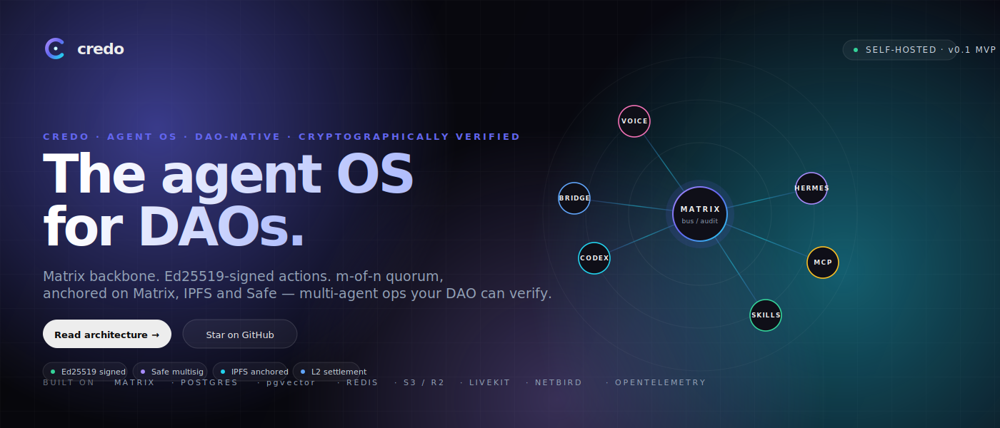
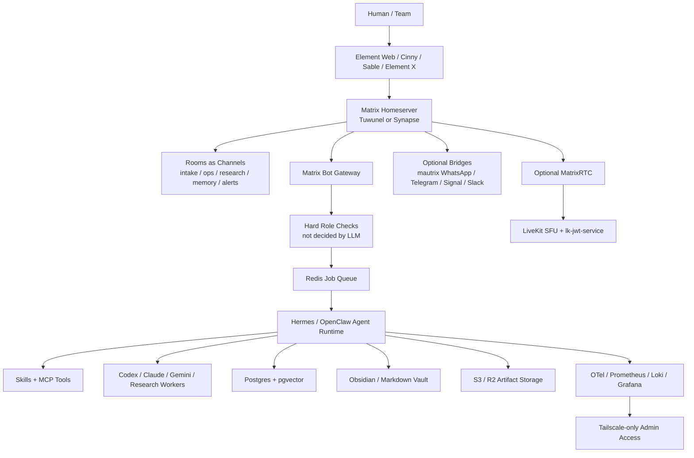
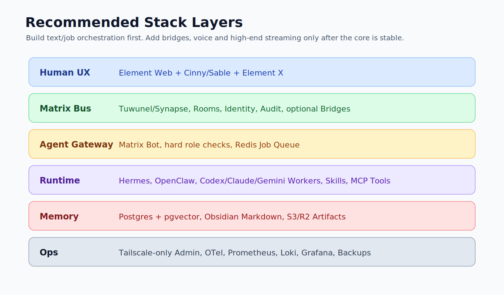

# Matrix + Hermes Agent Communication Stack

Eine kuratierte Architektur- und Technologieauswahl fuer ein selbst gehostetes Agent-Kommunikationssystem: Matrix als Raum-, Identity- und Audit-Bus; Hermes/OpenClaw/Codex als Agent-Orchestrierung dahinter.



## Kurzurteil

Der beste Stack ist nicht "Matrix als Agent-Framework", sondern:

```text
Matrix = Kommunikations-, Raum-, Identity- und Audit-Schicht
Hermes/OpenClaw = Agent Runtime, Skills, Tools, Memory, Automationen
LiveKit = optionaler Voice/Call/Streaming-Strang
Obsidian/Postgres = Memory, Wissen, RAG, Dokumentation
```

**MVP-Empfehlung:** Tuwunel oder Synapse, Element Web, Cinny/Sable, Hermes Matrix-Bot, Redis Queue, Postgres + pgvector, S3/R2, Tailscale-only Admin.

**Wenn maximale Kompatibilitaet wichtiger ist:** starte mit Synapse.  
**Wenn Ressourcen, RAM und S3 wichtiger sind:** teste Tuwunel zuerst.

## Bester Zielstack

| Ebene | Gewinner | Warum | GitHub |
|---|---|---|---|
| Homeserver | Tuwunel fuer Greenfield, Synapse fuer maximale Reife | Tuwunel ist leicht und S3-freundlich; Synapse ist die sichere Referenz | [tuwunel](https://github.com/matrix-construct/tuwunel), [synapse](https://github.com/element-hq/synapse) |
| Deployment | matrix-docker-ansible-deploy | Bewaehrte Matrix-Automation mit Docker, TLS, Bridges, TURN, Element | [spantaleev/matrix-docker-ansible-deploy](https://github.com/spantaleev/matrix-docker-ansible-deploy) |
| Webclient | Element Web + Cinny/Sable | Element als Referenz/Fallback, Cinny/Sable fuer schnelle Discord-artige UX | [element-web](https://github.com/element-hq/element-web), [cinny](https://github.com/cinnyapp/cinny), [Sable](https://github.com/SableClient/Sable) |
| Agent Gateway | Matrix Bot Account | Einfacher, sicherer und schneller als sofortiger Appservice oder Custom Client | [mautrix/python](https://github.com/mautrix/python), [matrix-rust-sdk](https://github.com/matrix-org/matrix-rust-sdk) |
| Agent Runtime | Hermes + OpenClaw | Skills, Tools, Subagents, Memory, lokale Automationen | [hermes-agent](https://github.com/NousResearch/hermes-agent), [openclaw](https://github.com/openclaw/openclaw), [clawhub](https://github.com/openclaw/clawhub) |
| Jobs | Redis Queue | Matrix Message rein, Job-ID zurueck, Worker fuehrt aus | [redis](https://github.com/redis/redis) |
| Memory/RAG | Postgres + pgvector | Robust, simpel, gut fuer Agent-Memory und semantische Suche | [pgvector](https://github.com/pgvector/pgvector) |
| Storage | S3/R2 native, keine FUSE-Mounts | Medien und Dateien direkt in Object Storage; Metadaten lokal | [synapse-s3-storage-provider](https://github.com/matrix-org/synapse-s3-storage-provider), [rclone](https://github.com/rclone/rclone) |
| Voice/RTC | Element Call + LiveKit spaeter | Solider separater Call-Strang, nicht Teil des Text-MVP | [element-call](https://github.com/element-hq/element-call), [livekit](https://github.com/livekit/livekit), [lk-jwt-service](https://github.com/element-hq/lk-jwt-service) |
| Knowledge Workspace | Obsidian Markdown + Git + Dataview/Smart Connections | Local-first, versionierbar, agentenfreundlich | [obsidian-dataview](https://github.com/blacksmithgu/obsidian-dataview), [smart-connections](https://github.com/brianpetro/obsidian-smart-connections), [obsidian-git](https://github.com/Vinzent03/obsidian-git) |

## Architektur





## MVP Scope

Der MVP soll **Text- und Job-Orchestrierung** stabil machen:

1. Matrix Homeserver aufsetzen.
2. Element Web + Cinny/Sable bereitstellen.
3. Einen Hermes/OpenClaw Matrix-Bot bauen.
4. Matrix-Nachrichten in Jobs verwandeln.
5. Jobs ueber Redis an Worker geben.
6. Ergebnisse in denselben Raum zurueckschreiben.
7. Postgres + pgvector fuer Memory/RAG anbinden.
8. S3/R2 fuer Artefakte und grosse Dateien verwenden.
9. Admin- und Observability nur ueber Tailscale exponieren.

## Nicht in den MVP

| Thema | Warum warten? |
|---|---|
| E2EE Recording | Bots brauchen echte Teilnehmer-Keys; hoher Engineering-Aufwand |
| 4K60 MatrixRTC | Bandbreite, Codecs, Simulcast und Browser-Limits machen es teuer |
| Eigener Matrix Client | Zu viel UI-/Crypto-/Sync-Komplexitaet |
| Meta/Instagram Bridges | Ban-/Proxy-/Session-Risiko |
| Agenten mit Admin-Tokens | Darf nur in eng begrenzten Ops-Raeumen passieren |
| Kubernetes | Fuer den Start Overkill; Ansible + Docker ist passender |

## Dokumente

- [Ausfuehrliche Vergleichstabelle](docs/stack-comparison.md)
- [Roadmap und Build-Plan](docs/implementation-roadmap.md)
- [Mermaid-Quellgraph](docs/architecture.mmd)

## Repo-Hinweis

Dieses Repo fasst die ausgewerteten Notion-Unterlagen und Subagent-Reviews als oeffentlichkeitsarme Architektur-Spezifikation zusammen. Es enthaelt keine Notion-Tokens, keine Roh-Exports und keine privaten Credentials.
