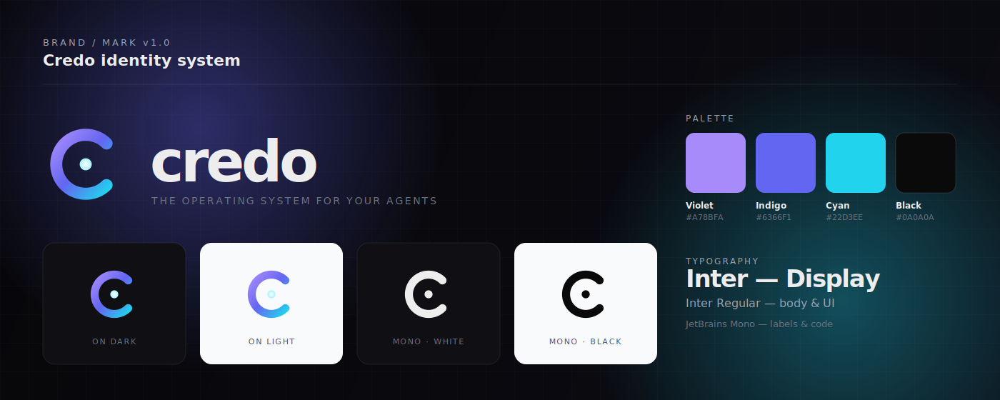
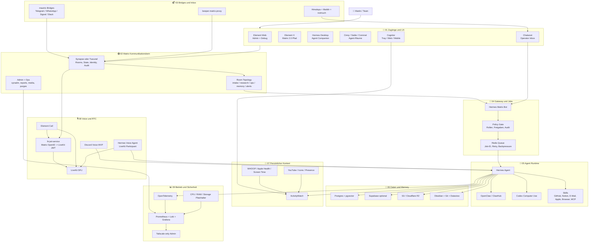

# Credo

**Credo** ist Martins Architekturdeck fuer einen selbst gehosteten Agent-Kommunikationsstack: **Matrix** als Raum-, Identity-, State- und Audit-Kontext; **Hermes/OpenClaw/Codex** als Agent Runtime; **Postgres, Obsidian, ActivityWatch und lokale Skills** als Memory-, Kontext- und Tool-Schicht.

> 🎯 **MVP:** Synapse als konservativer Start + Element/Cinny + Hermes Matrix-Bot + Redis + Postgres/pgvector + S3/R2 + Obsidian + ActivityWatch + Tailscale-only Admin. Tuwunel bleibt ein schlanker Kandidat, sobald Bot-, Bridge-, MatrixRTC- und MAS-Kompatibilitaet validiert sind.

## 🧭 Start Here

| Frage | Kurzantwort | Link |
|---|---|---|
| Was ist Credo? | Ein Matrix-zentriertes Betriebsmodell fuer Agentenarbeit. | [Operating Model](#%EF%B8%8F-operating-model) |
| Was ist entschieden? | Matrix ist Kontext und Audit-Timeline; Redis/Worker fuehren Jobs aus; Postgres/S3 sind das kanonische Ledger. | [Kurzurteil](#-kurzurteil) |
| Was baue ich zuerst? | Text-MVP mit Synapse, Clients, Bot, Redis, Postgres, R2/S3 und Tailscale. | [MVP Scope](#%EF%B8%8F-mvp-scope) |
| Wo sind Details? | Entscheidungen, Inventare, Roadmap und Research sind in `docs/` gesplittet. | [Detail-Dokumente](#-detail-dokumente) |

## 🎛️ Operating Model

Credo ist kein einzelnes Tool, sondern ein **Betriebsmodell fuer Agentenarbeit**:

| Regel | Bedeutung |
|---|---|
| 🟢 Jeder Auftrag hat einen Raum | Matrix liefert Kontext, Menschen, State und eine nachvollziehbare Timeline. |
| 🚦 Jede Aktion hat eine Policy | Rollen, Freigaben und Risiken werden im Backend entschieden, vor Redis und erneut vor jedem riskanten Tool Call. |
| 🧾 Jeder Lauf hat eine Job-ID | Redis/Worker entkoppeln lange Agentenarbeit vom Chat-Event. |
| 🗄️ Jedes Ergebnis hat ein Artefakt | S3/R2, Postgres und Matrix-Links halten Ergebnisse nachvollziehbar. |
| 🧠 Jede Erinnerung hat einen Status | Ephemeral, reviewed oder canonical statt ungeprueftes Langzeit-Memory. |
| 📊 Jeder Tool Call hat eine Spur | OTel/Grafana machen LLM, MCP, Tool, RAG und Subagenten debugbar. |

## 🧭 Gesamtbild

## 🧱 Stack-Kategorien

| Kategorie | Logos | Was es macht | Haupt-Dokument |
|---|---|---|---|
| 🟢 Kommunikation |   | Matrix-Räume, Nutzer, State, Federation, Audit, Clients | [Zielstack](docs/target-stack.md) |
| 📬 Inbox und Bridges |   | E-Mail, Beeper, Telegram, WhatsApp, Signal, Operator-Inbox | [Matrix Ops Runbook](docs/matrix-ops-runbook.md) |
| 🤖 Agent Runtime |    | Hermes, OpenClaw, Codex, Skills, Subagents, Computer Use | [Hermes Skills](docs/hermes-skills.md) |
| 🧠 Daten und Memory |    | Jobs, Agent-State, Audit, RAG, Artefakte, interne Dashboards | [Ressourcenplanung](docs/resource-planning.md) |
| 🧩 Wissen und Kontext |    | Obsidian Vault, ActivityWatch, WHOOP, Apple, YouTube, Presence | [Repo-Landkarte](docs/repository-map.md) |
| 🎙️ Voice und RTC |   | Discord Voice MVP, Element Call, LiveKit, OpenAI Realtime | [Architekturfluesse](docs/architecture-flows.md) |
| 📊 Betrieb |    | Logs, Metriken, Alerts, Tailscale-only Admin, Redaction | [Build-Plan](docs/implementation-roadmap.md) |

## ✅ Kurzurteil

Matrix ist **nicht** das Agent-Framework und auch **nicht** die interne Queue.

| Schicht | Entscheidung |
|---|---|
| 🟢 Matrix | Kommunikations-, Raum-, Identity-, State- und Audit-Timeline |
| 🚦 Redis/Worker | echte Job-Ausführung, Retries, Backpressure und Status |
| 🤖 Hermes/OpenClaw/Codex | Agent Runtime, Skills, Tools, Memory, Automationen |
| 🧠 Postgres/pgvector | Core Memory, kanonisches Audit, Agent-State und RAG |
| 🧩 ActivityWatch/Obsidian/Cognitor | persönlicher Kontext, Wissen, Lifelog und Dashboards |
| 🎙️ LiveKit/Discord Voice | separater späterer Voice-/Realtime-Strang |

**Synapse** ist der konservative Produktionsstart. **Tuwunel** ist der interessante Greenfield-Test, wenn RAM, S3 und schlanke Ops wichtiger sind. **Supabase** ist sinnvoll fuer schnelle interne Dashboards/Auth/Realtime, aber nicht als Ersatz fuer Core-Postgres + pgvector.

## 🏆 Bester Zielstack

| Kategorie | Gewinner | Gedacht fuer | Status |
|---|---|---|---|
| 🟢 Kommunikationskern | Synapse oder Tuwunel | Rooms, State, Federation, Audit | MVP-Entscheidung |
| 🚀 Deployment | matrix-docker-ansible-deploy | Homeserver, TLS, TURN, Clients, Bridges | empfohlen |
| 💬 UX | Element Web + Cinny/Sable + Element X | Admin, Alltag, Matrix-2.0, Agent-Räume | empfohlen |
| 🖥️ Agent Desktop | Hermes Desktop | lokale/remote Hermes-Konfiguration, Chat, Sessions, Skills, Gateways | sehr interessant |
| 📬 Inbox | Chatwoot + Himalaya + Maildir/notmuch | E-Mail, Beeper, Agent-Ops | aktiv/lokal |
| 🤖 Runtime | Hermes + OpenClaw + Codex | Skills, Subagents, Tools, Computer Use | Core |
| 🚦 Jobs | Redis Queue + Worker | Job-ID, Backpressure, Retry | Core |
| 🧠 Memory | Postgres + pgvector | Agent-State, Audit, RAG | Core |
| ⚡ App Layer | Supabase optional | Dashboard, Auth, Realtime, Studio | optional |
| 🗄️ Artefakte | S3 / Cloudflare R2 | Medien, Exporte, Reports | Core |
| 🧩 Wissen | Obsidian + Git + Dataview | Knowledge Vault und Audit Trail | aktiv |
| 📈 Kontext | ActivityWatch + Importer | Fokus, Health, Medien, Presence | aktiv |
| 🎙️ Voice | Discord MVP, später Element Call + LiveKit + lk-jwt-service | niedrige Latenz, Calls, Streaming, RTC-Foci | später |
| 🧑‍✈️ Voice Agent | Hermes als LiveKit Participant | Tool Calls und Raum-Zusammenfassungen aus Calls | später |
| 📊 Ops | OTel + Prometheus + Loki + Grafana | Logs, Metriken, Alerts | Core |
| 🔐 Admin | Tailscale | private Admin- und Dashboard-Schicht | Core |

## 📚 Detail-Dokumente

| Wenn du wissen willst... | Lies | Status |
|---|---|---|
| Was der Zielstack ist | [docs/target-stack.md](docs/target-stack.md) | Entscheidungsdoc |
| Wie die Flows laufen | [docs/architecture-flows.md](docs/architecture-flows.md) und [docs/architecture.mmd](docs/architecture.mmd) | Architektur |
| Wie Matrix betrieben wird | [docs/matrix-ops-runbook.md](docs/matrix-ops-runbook.md) | Runbook |
| Was zuerst gebaut wird | [docs/implementation-roadmap.md](docs/implementation-roadmap.md) | Roadmap |
| Welche Ressourcen gebraucht werden | [docs/resource-planning.md](docs/resource-planning.md) | Dimensionierung |
| Welche Services beteiligt sind | [docs/service-catalog.md](docs/service-catalog.md) | Katalog |
| Welche Packages/Skills existieren | [docs/package-inventory.md](docs/package-inventory.md) und [docs/hermes-skills.md](docs/hermes-skills.md) | Inventar |
| Welche Repos beteiligt sind | [docs/repository-map.md](docs/repository-map.md), [docs/local-repositories.md](docs/local-repositories.md), [docs/github-repositories.md](docs/github-repositories.md), [docs/matrix-repositories.md](docs/matrix-repositories.md) | Inventar |
| Welche Alternativen verglichen wurden | [docs/stack-comparison.md](docs/stack-comparison.md) | Vergleich |
| Welche Research-Ideen als Backlog gelten | [docs/research-improvements.md](docs/research-improvements.md) | Synthese |

## 🛣️ MVP Scope

1. 🟢 Matrix Homeserver aufsetzen.
2. 💬 Element Web + Cinny/Sable bereitstellen.
3. 🤖 Hermes/OpenClaw Matrix-Bot registrieren, inklusive Bot-Account/Appservice-Entscheidung, Power Levels, Rate Limits, Invite-Policy und E2EE-Key-Handling.
4. 🚦 Matrix-Nachrichten in Redis-Jobs verwandeln.
5. 🧠 Postgres + pgvector fuer Memory/RAG anbinden.
6. 🗄️ S3/R2 fuer Artefakte und grosse Dateien verwenden.
7. 📊 Redigierte Logs/Metriken intern sichtbar machen und Trace-ID zurueck in Matrix posten.
8. 🔐 Public Plane und Admin Plane trennen: Clients/Federation/Bridges kontrolliert oeffentlich, Admin-APIs, Grafana, Loki, Prometheus, Postgres, Redis, Supabase Studio und S3-Admin nur ueber Tailscale.

## ⏳ Nicht in den MVP

| Thema | Warum warten? |
|---|---|
| 🔒 E2EE Recording | Bots brauchen echte Teilnehmer-Keys; hoher Engineering-Aufwand |
| 🎥 4K60 MatrixRTC | Bandbreite, Codecs, Simulcast und Browser-Limits machen es teuer |
| 🧱 Eigener Matrix Client | Zu viel UI-/Crypto-/Sync-Komplexitaet |
| 📱 Meta/Instagram Bridges | Ban-, Proxy-, Session- und Cookie-Risiko |
| 🗝️ Agenten mit Admin-Tokens | Nur in eng begrenzten Ops-Raeumen mit Audit |
| ☸️ Kubernetes | Fuer den Start Overkill; Ansible + Docker ist passender |

## 🧼 Pflege-Regeln

- Neue Services zuerst in [docs/service-catalog.md](docs/service-catalog.md) eintragen.
- Neue lokale Packages in [docs/package-inventory.md](docs/package-inventory.md) kategorisieren.
- Neue eigene Repos in [docs/repository-map.md](docs/repository-map.md) einordnen.
- GitHub-Stars, lokale Repo-Zustaende und Screenshots sind Momentaufnahmen und muessen bei groesseren Updates neu validiert werden.
- Generierte Inventare nicht von Hand schoenfaerben; lieber Quelle, Datum und Erzeugungsweg sichtbar lassen.
- Architekturveraenderungen im README-Diagramm und in [docs/architecture.mmd](docs/architecture.mmd) synchron halten.
- Keine Tokens, Roh-Exports, personenbezogenen Chat-Inhalte oder privaten Credentials einchecken.

## 🔗 Repo-Hinweis

[Credo](https://github.com/Martin-Hausleitner/Credo) fasst die ausgewerteten Notion-Unterlagen, lokalen Repo-Infos und Stack-Reviews als private Architektur-Spezifikation zusammen. Es enthaelt keine Notion-Tokens, keine Roh-Exports und keine privaten Credentials.
