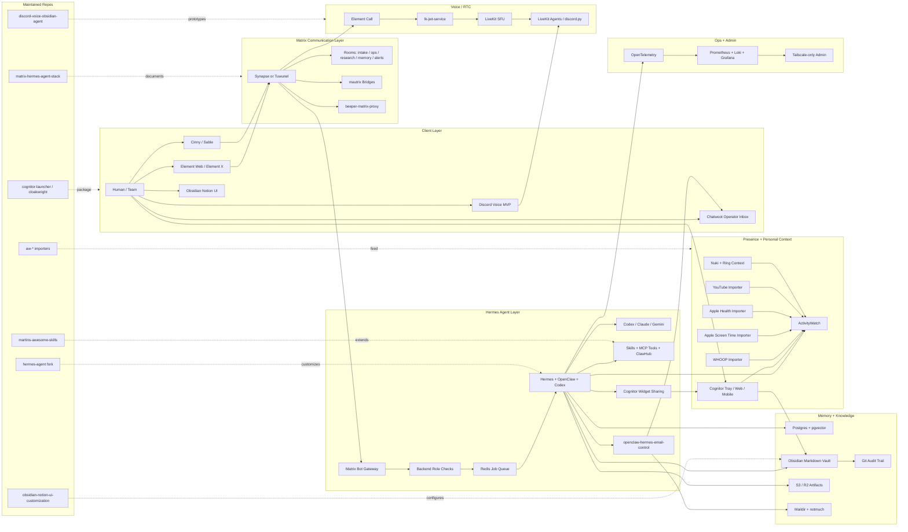
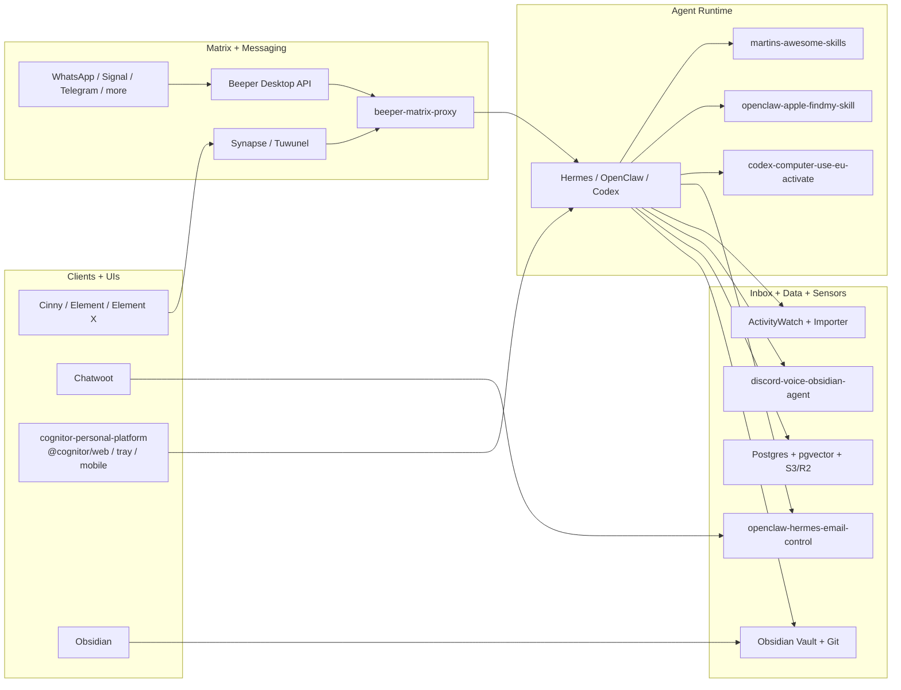
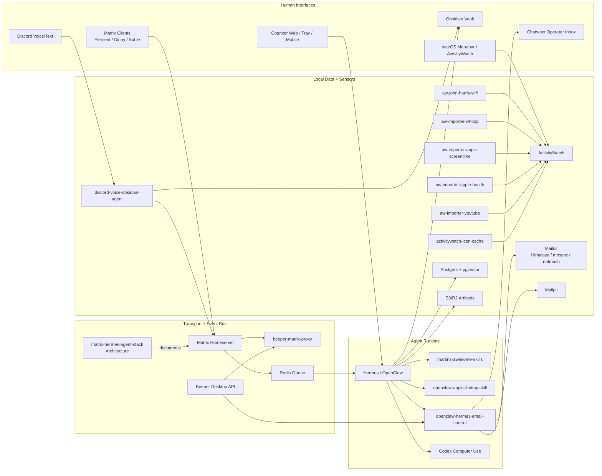

# Matrix + Hermes Agent Communication Stack

Ein pflegbares Architekturdeck fuer Martins selbst gehosteten Agent-Kommunikationsstack: Matrix als Raum-, Identity- und Audit-Bus; Hermes/OpenClaw/Codex als Agent-Runtime; ActivityWatch, WHOOP, Obsidian und lokale Skills als persoenlicher Daten- und Tool-Layer.


## Kurzurteil

Der beste Stack ist nicht "Matrix als Agent-Framework", sondern:

```text
Matrix = Kommunikations-, Raum-, Identity- und Audit-Schicht
Hermes/OpenClaw = Agent Runtime, Skills, Tools, Memory, Automationen
ActivityWatch/WHOOP/Obsidian/Cognitor = persoenlicher Kontext, Wissen, Lifelog und Widget-Dashboards
LiveKit = optionaler Voice/Call/Streaming-Strang
```

**MVP-Empfehlung:** Synapse oder Tuwunel, Element Web, Cinny/Sable, Hermes Matrix-Bot, Redis Queue, Postgres + pgvector, S3/R2, Tailscale-only Admin.

**Wenn maximale Kompatibilitaet wichtiger ist:** starte mit Synapse.  
**Wenn Ressourcen, RAM und S3 wichtiger sind:** teste Tuwunel zuerst.

## Bester Zielstack

| Ebene | Paket / Gewinner | Warum | Upstream GitHub | Eigene Umsetzung |
|---|---|---|---|---|
| Homeserver | Synapse oder Tuwunel | Synapse ist die sichere Referenz; Tuwunel ist leicht und S3-freundlich | [synapse](https://github.com/element-hq/synapse), [tuwunel](https://github.com/matrix-construct/tuwunel) | [matrix-hermes-agent-stack](https://github.com/Martin-Hausleitner/matrix-hermes-agent-stack) |
| Deployment | matrix-docker-ansible-deploy | Bewaehrte Matrix-Automation mit Docker, TLS, Bridges, TURN und Element | [spantaleev/matrix-docker-ansible-deploy](https://github.com/spantaleev/matrix-docker-ansible-deploy) | Dieses Repo als Runbook |
| Clients | Element Web + Cinny/Sable | Element als Referenz/Fallback, Cinny/Sable fuer schnelle Discord-artige UX | [element-web](https://github.com/element-hq/element-web), [cinny](https://github.com/cinnyapp/cinny), [Sable](https://github.com/SableClient/Sable) | Raum- und UX-Konzept in diesem Repo |
| Gateway | Matrix Bot Account | Einfacher, sicherer und schneller als sofortiger Appservice oder Custom Client | [mautrix/python](https://github.com/mautrix/python), [matrix-rust-sdk](https://github.com/matrix-org/matrix-rust-sdk) | [beeper-matrix-proxy](https://github.com/Martin-Hausleitner/beeper-matrix-proxy) als Bridge-Referenz |
| Inbox Bridge | Chatwoot + Himalaya + mbsync/notmuch + Mailpit | E-Mail, Matrix/Beeper und Agent-Ops laufen in einer lokalen Operator-Inbox zusammen | [chatwoot](https://github.com/chatwoot/chatwoot), [himalaya](https://github.com/pimalaya/himalaya), [notmuch](https://github.com/notmuch/notmuch), [mailpit](https://github.com/axllent/mailpit) | `/Users/mh/Documents/Playground/openclaw-hermes-email-control` |
| Runtime | Hermes + OpenClaw + Codex | Skills, Tools, Subagents, Memory, lokale Automationen | [hermes-agent](https://github.com/NousResearch/hermes-agent), [openclaw](https://github.com/openclaw/openclaw), [clawhub](https://github.com/openclaw/clawhub) | [martins-awesome-skills](https://github.com/Martin-Hausleitner/martins-awesome-skills), [codex-computer-use-eu-activate](https://github.com/Martin-Hausleitner/codex-computer-use-eu-activate) |
| Jobs | Redis Queue | Matrix Message rein, Job-ID zurueck, Worker fuehrt aus | [redis](https://github.com/redis/redis) | Zielkomponente im MVP |
| Memory/RAG | Postgres + pgvector | Robust, simpel, gut fuer Agent-Memory und semantische Suche | [postgres](https://github.com/postgres/postgres), [pgvector](https://github.com/pgvector/pgvector) | Zielkomponente im MVP |
| Storage | S3/R2 | Artefakte, Medien, Exporte und grosse Dateien ohne FUSE-Mounts | [synapse-s3-storage-provider](https://github.com/matrix-org/synapse-s3-storage-provider), [rclone](https://github.com/rclone/rclone) | Zielkomponente im MVP |
| Knowledge | Obsidian Markdown + Git | Local-first, versionierbar, agentenfreundlich | [obsidian-dataview](https://github.com/blacksmithgu/obsidian-dataview), [smart-connections](https://github.com/brianpetro/obsidian-smart-connections), [obsidian-git](https://github.com/Vinzent03/obsidian-git) | [obsidian-notion-ui-customization](https://github.com/Martin-Hausleitner/obsidian-notion-ui-customization) |
| Presence/Lifelog | ActivityWatch + WHOOP + lokale Importer | Tagesstatus, Fokus, Schlaf, Training, Screen Time, Mediennutzung und Icons/Favicons | [ActivityWatch](https://github.com/ActivityWatch/activitywatch) | [aw-john-harris-wifi](https://github.com/Martin-Hausleitner/aw-john-harris-wifi), [aw-importer-whoop](https://github.com/Martin-Hausleitner/aw-importer-whoop), [aw-importer-apple-screentime](https://github.com/Martin-Hausleitner/aw-importer-apple-screentime), [aw-importer-youtube](https://github.com/Martin-Hausleitner/aw-importer-youtube), `activitywatch-icon-cache` |
| Dashboard + Widget Sharing | Cognitor Tray/Web/Mobile + Matrix Widgets | Persoenliche Statistiken lokal anzeigen und kontrolliert als Bild, Widget oder Tailnet-Link teilen | [matrix-widget-api](https://github.com/matrix-org/matrix-widget-api), [OpenUI](https://github.com/wandb/openui), [Playwright](https://github.com/microsoft/playwright) | [cognitor-launcher](https://github.com/Martin-Hausleitner/cognitor-launcher), [Cognitor Widget Sharing](docs/cognitor-widget-sharing.md) |
| Voice/RTC | Element Call + LiveKit | Solider separater Call-Strang, nicht Teil des Text-MVP | [element-call](https://github.com/element-hq/element-call), [livekit](https://github.com/livekit/livekit), [lk-jwt-service](https://github.com/element-hq/lk-jwt-service) | [discord-voice-obsidian-agent](https://github.com/Martin-Hausleitner/discord-voice-obsidian-agent) als schneller Voice-Prototyp |
| Observability | OTel + Prometheus + Loki + Grafana | Interne Metriken, Logs, Traces und Alerts | [opentelemetry-collector](https://github.com/open-telemetry/opentelemetry-collector), [prometheus](https://github.com/prometheus/prometheus), [loki](https://github.com/grafana/loki), [grafana](https://github.com/grafana/grafana) | Tailscale-only Admin |

## Package- und Tool-Inventar

Diese Tabelle ist die zentrale Liste fuer die Packages, Frameworks und Services, die im Stack genutzt werden oder als Zielkomponente vorgesehen sind. Sie ist aus den lokalen Manifests (`package.json`, `pyproject.toml`, `go.mod`, `Cargo.toml`) und den Zielstack-Entscheidungen verdichtet. Das Repo selbst ist ein Architekturdeck; deshalb ist die Tabelle bewusst ein gepflegtes Inventar und keine automatisch generierte Lockfile-Liste.

| Paket / Tool | Kategorie | Wird genutzt in | Zweck | Status |
|---|---|---|---|---|
| `react` / `react-dom` | Frontend | Cognitor, Cloakwright, Dashboards | Lokale Web-UIs und Dashboard-Komponenten | aktiv |
| `vite` / `@vitejs/plugin-react` | Frontend Build | Cognitor, Cloakwright, Dashboard-Prototypen | Lokale Web-/Tauri-UI bauen und previewen | aktiv |
| `typescript` | Sprache/Typing | Cognitor, Voice Agent, lokale Tools | Typisierte UI- und Tool-Entwicklung | aktiv |
| `lucide-react` | UI Icons | Cognitor, Obsidian-UI-Demos, Dashboards | Einheitliche Icons fuer Tools, Status und Navigation | aktiv |
| `@tauri-apps/api` / `@tauri-apps/cli` | Desktop App | Cognitor Tray / Launcher | Native macOS Tray-/Desktop-App | aktiv |
| `expo` / `react-native` / `@expo/vector-icons` | Mobile | mobile Companion-Prototypen | Mobile Companion / LAN-Prototyp | aktiv |
| `expo-constants` | Mobile Runtime | Cognitor Mobile | Runtime- und Build-Metadaten im Companion | aktiv |
| `playwright` | E2E/Browser | Root Workspace | Browser-Validierung und Screenshots | aktiv |
| `@cognitor/activitywatch` | internes Package | Cognitor Launcher | ActivityWatch-Daten normalisieren | aktiv |
| `@cognitor/dashboard-ui` | internes Package | Cognitor Launcher | Wiederverwendbare Dashboard-UI | aktiv |
| `@cognitor/icons` | internes Package | Cognitor Launcher | Icon- und Asset-Zwischenschicht | aktiv |
| `@cognitor/tray` | interne App | Cognitor Launcher | macOS Tray, Popover, lokale API und Service-Status | aktiv |
| `@cognitor/web` | interne App | Cognitor Launcher | Lokales read-only Dashboard auf `127.0.0.1`/Tailnet | aktiv |
| `@cognitor/mobile` | interne App | Cognitor Launcher | Expo Companion mit LAN-/Tailnet-Zugriff | aktiv |
| `chrono` / `reqwest` / `serde` / `serde_json` | Rust Backend | Cognitor Tauri Backend | Zeitfenster, HTTP zu ActivityWatch/WHOOP/Wetter, Snapshot-Serialisierung | aktiv |
| `tauri` / `tauri-build` / `window-vibrancy` | Rust Desktop | Cognitor Tray | Native macOS-Menueleiste, Fenster, Tray-Icon und Apple-artige Transparenz | aktiv |
| `node:test` | Test Runner | aw-importer-youtube | importer-nahe Unit Tests ohne zusaetzlichen Runner | aktiv |
| `sqlite3` CLI | lokales Tool | aw-importer-youtube | Chromium-History sicher aus SQLite-Kopien lesen | aktiv |
| `yt-dlp` | Metadaten | aw-importer-youtube | YouTube Titel, Kanal, Beschreibung, Dauer und Stats anreichern | aktiv |
| `python` / `click` / `python-dateutil` / `platformdirs` | CLI Importer | ActivityWatch Importer | robuste lokale Importer-CLIs, lokale Config und Zeitnormalisierung | aktiv |
| `httpx` | HTTP Client | WHOOP, Apple Health, Screen Time und Voice Worker | API-Zugriffe und lokale Service-Checks | aktiv |
| `pytest` / `pytest-asyncio` / `ruff` / `mypy` | Python Qualitaet | ActivityWatch Importer, Voice Worker, Sense, Sonar | synchrone/asynchrone Regressionstests, Linting, Formatierung und Typpruefung | aktiv |
| `@clack/prompts` | CLI UX | discord-voice-obsidian-agent | interaktive lokale Worker-/Setup-Prompts | aktiv |
| `tsx` | TypeScript Runtime | discord-voice-obsidian-agent | TS-Skripte ohne separaten Build ausfuehren | aktiv |
| `prisma` | Datenzugriff | discord-voice-obsidian-agent | strukturierter DB-Zugriff fuer Voice-/Transcript-Flows | aktiv |
| `sharp` | Medienverarbeitung | beeper-matrix-proxy | Avatare/Medien fuer Bridge-Proofs verarbeiten | aktiv |
| `next` / `preact` / `tailwindcss` / `sass` | Web UI | discord-voice-obsidian-agent Dashboard | Voice-/Recording-Dashboard und schnelle Web-Oberflaechen | aktiv |
| `fastify` / `@fastify/*` | Node API | discord-voice-obsidian-agent Download/API | Download-, WebSocket-, Static- und Rate-Limit-API | aktiv |
| `eris` / `slash-create` / `@discordjs/opus` / `sodium-native` | Discord Runtime | discord-voice-obsidian-agent Bot | Discord Voice/Text, Slash Commands, Opus Audio und Voice-Crypto | aktiv |
| `discord.py[voice]` / `discord-ext-voice-recv` / `py-cord[voice]` | Discord Voice | Transcriber Worker / Voice Agent | Voice Receive, Audio Capture und alternative Bot-Prototypen | optional |
| `ioredis` / `fastq` / `cron` | Queue/Scheduler | Voice Agent und Tasks | Jobs, Backpressure, Cache und geplante Worker-Laeufe | aktiv |
| `prom-client` / `winston` / `@sentry/node` | Node Observability | Voice Agent und Tasks | Metriken, strukturierte Logs und Fehlerberichte | aktiv |
| `googleapis` / `dropbox` | Cloud Export | Voice/Craig-Komponenten | optionale Exportpfade fuer Aufnahmen und Transkripte | optional |
| `zod` / `@trpc/client` / `@trpc/server` | Typed APIs | lokale Dashboards / Voice Agent | typisierte Client-/Server-Vertraege | aktiv |
| `fastapi` / `uvicorn` / `pydantic` / `pydantic-settings` | Python Services | Voice Transcriber Worker, Sense, lokale API-Prototypen | typed HTTP Worker, Settings und Service-Endpunkte | aktiv |
| `python-multipart` / `psutil` | Python Worker | Transcriber Worker, Sense | Datei-Uploads, Audio-Payloads und lokale Prozess-/Systemdaten | aktiv |
| `faster-whisper` / `sherpa-onnx` | ASR | Voice Transcriber Worker | lokale Speech-to-Text-Optionen fuer Voice Agents | optional/aktiv |
| `jinja2` | Python Templates | Sense | leichte serverseitige Views fuer lokales Web-UI | aktiv |
| `axum` / `tokio` / `tower` / `tower-http` | Rust API | onlyapi / Money-Maker-Services | robuste Rust-Gateways und SDK-Routen | aktiv |
| `tracing` / `tracing-subscriber` / `dotenvy` | Rust Ops | onlyapi / Rust Services | strukturierte Logs und lokale Konfiguration | aktiv |
| Synapse | Matrix Homeserver | Matrix Core | Konservativer Produktivstart mit bester Kompatibilitaet | MVP-Option |
| Tuwunel | Matrix Homeserver | Matrix Core | Ressourcenschonender Greenfield-Homeserver | MVP-Option |
| matrix-docker-ansible-deploy | Deployment | Matrix Ops | Homeserver, TLS, TURN, Bridges und Clients automatisiert deployen | empfohlen |
| Element Web | Matrix Client | Web/Admin | Referenz-, Admin- und Debug-Client | empfohlen |
| Element X iOS / Android | Matrix Client | Mobile | Mobile Hauptaccounts und Matrix 2.0 UX | optional |
| Cinny | Matrix Client | Web UX | Schnelle Discord-artige UX fuer Agentenraeume | empfohlen |
| Sable | Matrix Client | Web UX | Cinny-Fork mit Power-UX und QoL-Fokus | optional |
| Commet | Matrix Client | Alternative UX | Multi-Account-orientierter Matrix Client | beobachten |
| mautrix/python | Matrix SDK | Bot Gateway | Schneller Python-Bot und spaeter Appservice-Pfad | kern |
| matrix-rust-sdk | Matrix SDK | Bot/Gateway spaeter | Performanter Rust-Service fuer harte Runtime-Komponenten | spaeter |
| mautrix/telegram | Bridge | Messenger | Telegram in Matrix spiegeln | Bridge-Phase |
| mautrix/whatsapp | Bridge | Messenger | WhatsApp in Matrix spiegeln | Bridge-Phase |
| mautrix/signal | Bridge | Messenger | Signal in Matrix spiegeln | Bridge-Phase |
| mautrix/discord | Bridge | Messenger | Discord in Matrix, bevorzugt Bot/Guild sauber | optional |
| mautrix/slack | Bridge | Messenger | Slack in Matrix | optional |
| bridge-manager | Bridge Ops | Beeper/Bridge Betrieb | Bridge-Management als Referenz und Admin-Helfer | optional |
| beeper-matrix-proxy | Eigene Bridge | Beeper/BIPA -> Matrix | Beeper-Chats als Matrix-Portale in Cinny/Element nutzbar machen | aktiv |
| desktop-api-go | Beeper SDK | Beeper Desktop API | Lokale Beeper REST-API fuer Chat-, Media- und Account-Export | geplant/aktiv |
| mautrix/go bridgev2 | Bridge Framework | Matrix Appservices | Capabilities, Media, Backfill und Portal-/Puppet-Modelle | aktiv |
| `mautrix-go` / `go.mau.fi/util` | Go Matrix SDK | beeper-matrix-proxy, bridge-manager | Matrix-Appservice-, Bridge- und Utility-Funktionen | aktiv |
| `zerolog` / `lumberjack` | Go Logging | beeper-matrix-proxy, bridge-manager | strukturierte Logs und Rotation | aktiv |
| `go-sqlite3` / `lib/pq` | Go Datenbanken | beeper-matrix-proxy, bridge-manager | lokale Appservice-, Bridge- und Admin-Datenbanken | aktiv |
| `coder/websocket` / `gjson` / `sjson` | Go API Tools | bridge-manager / Beeper Tools | WebSocket- und JSON-Operationen fuer Bridge-Management | aktiv |
| `survey` / `urfave/cli` / `progressbar` | Go CLI UX | bridge-manager | interaktive CLIs, Subcommands und Fortschritt | aktiv |
| Beeper Desktop API | lokaler Dienst | `127.0.0.1:23373` | Lokale Beeper-Raumlisten und Sync-Aktionen als kontrollierte Quelle | lokal aktiv |
| Chatwoot | Inbox/Ops | `openclaw-hermes-email-control` / lokaler Docker Stack | Gemeinsame Operator-Inbox fuer Chat, Matrix/Beeper und E-Mail | lokal aktiv |
| Mailpit | Mail Dev/Ops | `infra/chatwoot-local` | Sicherer lokaler SMTP-/Mail-Testlauf ohne externen Versand | lokal aktiv |
| Himalaya | E-Mail CLI | lokaler Mail-Stack | Accounts lesen, triagieren und fuer Agenten bereitstellen | aktiv |
| mbsync/isync | E-Mail Sync | lokaler Maildir-Stack | Mailboxen lokal spiegeln | teilaktiv |
| notmuch | E-Mail Index | lokaler Maildir-Stack | Schnelle Suche und Agentenfilter ueber Maildir | vorgesehen |
| Hermes Agent | Agent Runtime | Matrix Bot Worker | Orchestrierung, Sessions, Memory, Automationen | kern |
| OpenClaw | Agent Runtime | Lokaler Tool Layer | Skills, Tools und lokale Agent-Ausfuehrung | kern |
| ClawHub | Skill Registry | Skill Distribution | Katalog, Trust und Install-Layer fuer Skills | spaeter |
| Codex Computer Use | Native UI Automation | macOS/iPhone Mirroring | Native App-Steuerung und E2E-Validierung | aktiv |
| Redis | Queue | Gateway -> Worker | Matrix-Events entkoppeln und Jobs verteilen | kern |
| Postgres | Datenbank | Memory/Audit | Persistente Agent-, Audit- und App-Daten | kern |
| pgvector | Vector Search | Memory/RAG | Semantische Suche und Embedding-Storage | kern |
| Cloudflare R2 / S3 | Object Storage | Artefakte/Medien | Reports, Exporte, grosse Dateien und Matrix-Medien | kern |
| rclone | Storage Tool | Backup/Sync | Optionaler Storage-Transport und Backups | optional |
| Obsidian | Knowledge Base | Memory/Vault | Local-first Wissens- und Dokumentationsbasis | aktiv |
| Dataview | Obsidian Plugin | Vault Queries | Strukturierte Abfragen ueber Markdown/YAML | aktiv |
| Smart Connections | Obsidian Plugin | Vault RAG | Semantische Suche direkt im Vault | optional |
| Obsidian Git | Obsidian Plugin | Audit/Sync | Versionierung und Audit Trail fuer Memory | aktiv |
| ActivityWatch | Lifelog | Presence/Focus/Timeline | Lokale Aktivitaets-, Status- und Kontextdaten | aktiv |
| WHOOP Importer | Health Import | ActivityWatch | Schlaf und Training in ActivityWatch einspielen | aktiv |
| Apple Screen Time Importer | Device Import | ActivityWatch | iOS/macOS Screen-Time in ActivityWatch einspielen | aktiv |
| YouTube Importer | Media Import | ActivityWatch | Watch Sessions und Mediennutzung einspielen | aktiv |
| Nuki Bridge HTTP API | Door Context | Presence/Audit | Lokale Schlossdaten als Statussignal | aktiv |
| Ring API / CLI | Door Context | Presence/Audit | Ring Intercom Events und History via Cloud API | aktiv, Cloud-abhaengig |
| Element Call | RTC | Matrix Voice | MatrixRTC Frontend fuer spaetere Calls | spaeter |
| LiveKit | RTC/SFU | Voice/Streaming | SFU, Realtime Media, Agents und Egress | spaeter |
| lk-jwt-service | RTC Auth | MatrixRTC + LiveKit | Auth-Layer zwischen MatrixRTC und LiveKit | spaeter |
| LiveKit Egress | RTC Recording | Recording | Recording fuer unverschluesselte Call-Raeume | spaeter |
| LiveKit Agents | Voice Agents | AI Voice | Voice-Agent-Layer auf LiveKit | spaeter |
| OpenAI Realtime Agents | Voice MVP | Voice Prototyping | Niedrige Latenz fuer schnellen Voice-Agent-Pfad | optional |
| discord.py | Voice MVP | Discord Voice | Schneller praktischer Discord-Voice-Prototyp | optional |
| OpenTelemetry Collector | Observability | Runtime/Ops | Traces und Metriken mit Redaction | kern |
| Prometheus | Observability | Metrics | Metriken und Alerts | kern |
| Loki | Observability | Logs | Redigierte Logs intern speichern | kern |
| Grafana | Observability | Dashboards | Matrix-, Bridge-, Agent- und Host-Dashboards | kern |
| Tailscale | Private Network | Admin/Ops | Admin und Observability nur intern erreichbar machen | kern |
| agent-secrets | Security | Tool Runtime | Secret Handling fuer Agenten | optional |
| agent-scan | Security | Skill Review | Agent-/Skill-Risiken pruefen | optional |
| Atropos | Evals | Agent Quality | Agent-/Skill-Evals und Regressionstests | optional |

## Aktive Workspace-Packages

Diese Tabelle spiegelt die konkret gefundenen Workspace-Pakete im lokalen Playground wider. Sie sitzt bewusst zwischen Architektur und Inventar: nah genug an der echten Nutzung, aber noch lesbar als Deck.

| Package | Typ | Wichtige Dependencies | Rolle im Stack | Status |
|---|---|---|---|---|
| `cognitor-personal-platform` | Root Workspace | `playwright`, `@tauri-apps/cli` | Monorepo fuer Web-, Tray- und Mobile-Agent-UIs sowie Browser-Validierung | aktiv |
| `@cognitor/web` | App | `react`, `react-dom`, `lucide-react`, `vite`, `typescript` | Browser-/Dashboard-Oberflaeche fuer persoenliche Agent-Views | aktiv |
| `@cognitor/tray` | App | `@tauri-apps/api`, `react`, `react-dom`, `lucide-react`, `vite`, `typescript` | Native macOS Tray-/Desktop-Einstieg fuer Cognitor | aktiv |
| `@cognitor/mobile` | App | `expo`, `expo-constants`, `react-native`, `@expo/vector-icons`, `react` | Mobile Companion und lokaler Netzwerk-/Presence-Zugriff | aktiv |
| `@cognitor/dashboard-ui` | internes Package | `react`, `lucide-react` | Wiederverwendbare UI-Bausteine fuer Dashboard- und Operator-Oberflaechen | aktiv |
| `@cognitor/activitywatch` | internes Package | lokale ActivityWatch-Adapter | ActivityWatch-Datenmodell und Normalisierung fuer UIs/Exports | aktiv |
| `@cognitor/icons` | internes Package | lokaler Asset-/Icon-Layer | Konsistente App-/Dienst-Assets fuer Timeline, Dashboard und Agent-Clients | aktiv |

## Package-Familien nach Repo

Diese Sicht beantwortet die praktische Frage: _welches Repo traegt welche Packages oder Laufzeitbausteine wirklich?_ So bleibt das Deck pflegbar, auch wenn einzelne Komponenten spaeter verschoben werden.

| Repo | Eigene Packages / Laufzeitbausteine | Stack-Funktion |
|---|---|---|
| [matrix-hermes-agent-stack](https://github.com/Martin-Hausleitner/matrix-hermes-agent-stack) | Architekturdeck, Tabellen, Mermaid-Diagramme | Zentrale Systemkarte und Planungsdoku |
| [cognitor-launcher](https://github.com/Martin-Hausleitner/cognitor-launcher) | `cognitor-personal-platform`, `@cognitor/web`, `@cognitor/tray`, `@cognitor/mobile`, `@cognitor/dashboard-ui`, `@cognitor/activitywatch`, `@cognitor/icons` | lokaler Personal-Agent-Launcher mit Web-, Tray-, Mobile- und ActivityWatch-Oberflaechen |
| [beeper-matrix-proxy](https://github.com/Martin-Hausleitner/beeper-matrix-proxy) | `beeper-source`, `mautrix-go bridgev2`, Avatar-/Portal-Sync, Cinny Room-List Enhancer | Beeper/BIPA -> Matrix Portale, Client-spezifische Avatar-UX |
| [martins-awesome-skills](https://github.com/Martin-Hausleitner/martins-awesome-skills) | Hermes/OpenClaw Skills, Prompts, Automations, Research-Tools | Wiederverwendbarer Skill-Layer fuer Agenten |
| `openclaw-hermes-email-control` | `emailctl`, Chatwoot Local Bridge, Maildir-/Inbox-Checks | E-Mail-, Chatwoot- und Operator-Inbox-Kontrolle |
| [aw-importer-whoop](https://github.com/Martin-Hausleitner/aw-importer-whoop) | Python CLI, WHOOP -> ActivityWatch Importer | Schlaf-, Training- und Recovery-Kontext |
| [aw-importer-apple-screentime](https://github.com/Martin-Hausleitner/aw-importer-apple-screentime) | Python CLI, Screen Time -> ActivityWatch Importer | iPhone/macOS App-Nutzung und Fokuszeiten |
| [aw-importer-youtube](https://github.com/Martin-Hausleitner/aw-importer-youtube) | Node CLI, `yt-dlp`, SQLite-Reader | Medien-/Watch-History fuer Lifelog und Tageskontext |
| [aw-john-harris-wifi](https://github.com/Martin-Hausleitner/aw-john-harris-wifi) | Presence-/Wi-Fi-/Door-Kontext-Logik | Lokaler Status, Zuhause/Buero, Nuki/Ring-Signale |
| [discord-voice-obsidian-agent](https://github.com/Martin-Hausleitner/discord-voice-obsidian-agent) | Voice Worker, Dashboard, Download-/Task-Apps | Voice-Agent-Prototyp, ASR, Obsidian-Anbindung |
| [obsidian-notion-ui-customization](https://github.com/Martin-Hausleitner/obsidian-notion-ui-customization) | UI-/Vault-Experimente | Knowledge- und Personal-OS-Layer |
| [openclaw-apple-findmy-skill](https://github.com/Martin-Hausleitner/openclaw-apple-findmy-skill) | Find My Skill + lokale Integrationen | Personen-, Geraete- und Standortkontext |
| [codex-computer-use-eu-activate](https://github.com/Martin-Hausleitner/codex-computer-use-eu-activate) | Codex/Computer-Use Aktivierungs-Skill | Native UI-Automation und visuelle E2E-Validierung |
| [mac-ai-dev-setup](https://github.com/Martin-Hausleitner/mac-ai-dev-setup) | Setup-Skripte, Toolchain, lokale Runtime-Vorbereitung | Host-Grundlage fuer Agent-Betrieb |
| [mac-ram-rescue](https://github.com/Martin-Hausleitner/mac-ram-rescue) | Memory-/Ops-Helfer | Stabilitaet und Ressourcenpflege auf dem Host |

## Eigene Repos und Arbeitsbereiche

Diese Liste fokussiert die aktuellen agentenrelevanten Repos und Workspaces. Alias-Faelle sind bewusst ausgeschrieben: Links steht der lokale Ordner, rechts das tatsaechliche GitHub-Repo.

### Eigene GitHub-Repos

| Repo / Workspace | Rolle im Stack | Lokaler Pfad | Remote / Status |
|---|---|---|---|
| matrix-hermes-agent-stack | Dieses Architekturdeck und Build-Plan | `/Users/mh/Documents/Playground/matrix-hermes-agent-stack` | [Repo](https://github.com/Martin-Hausleitner/matrix-hermes-agent-stack) |
| cognitor-personal-platform | Monorepo fuer `@cognitor/web`, `@cognitor/tray`, `@cognitor/mobile` und interne UI-Packages | `/Users/mh/Documents/Playground` | Root-Workspace von [cognitor-launcher](https://github.com/Martin-Hausleitner/cognitor-launcher) |
| openclaw-hermes-public-skills | Public-safe Hermes/OpenClaw Skill-Sammlung | `/Users/mh/Documents/Playground/openclaw-hermes-public-skills` | [martins-awesome-skills](https://github.com/Martin-Hausleitner/martins-awesome-skills) |
| openclaw-apple-findmy-skill | OpenClaw Skill fuer Apple Find My / Standort-Kontext | `/Users/mh/Documents/Playground/openclaw-apple-findmy-skill` | [Repo](https://github.com/Martin-Hausleitner/openclaw-apple-findmy-skill) |
| codex-computer-use-eu-activate | Codex Computer Use EU Activation Skill | `/Users/mh/Documents/Playground/codex-computer-use-eu-activate` | [Repo](https://github.com/Martin-Hausleitner/codex-computer-use-eu-activate) |
| aw-john-harris-wifi | ActivityWatch Presence, Wi-Fi, Nuki/Ring und Fokus-Status | `/Users/mh/Documents/GitHub/aw-john-harris-wifi` | [Repo](https://github.com/Martin-Hausleitner/aw-john-harris-wifi) |
| aw-importer-whoop | WHOOP Schlaf und Training nach ActivityWatch | `/Users/mh/Documents/Playground/aw-importer-whoop` | [Repo](https://github.com/Martin-Hausleitner/aw-importer-whoop) |
| aw-importer-apple-screentime | Apple Screen Time nach ActivityWatch | `/Users/mh/Documents/Playground/aw-importer-apple-screentime` | [Repo](https://github.com/Martin-Hausleitner/aw-importer-apple-screentime) |
| aw-importer-apple-health | Apple Health Export nach ActivityWatch | `/Users/mh/.openclaw/workspace/aw-importer-apple-health` | [Repo](https://github.com/Martin-Hausleitner/aw-importer-apple-health) |
| activitywatch-youtube-sync | YouTube Watch Sessions nach ActivityWatch | `/Users/mh/Documents/Playground/activitywatch-youtube-sync` | [aw-importer-youtube](https://github.com/Martin-Hausleitner/aw-importer-youtube) |
| aw-activitywatch-stack | ActivityWatch Gesamt-Doku, LaunchAgent- und Export-Workflows | `/Users/mh/.openclaw/workspace/aw-activitywatch-stack` | [Repo](https://github.com/Martin-Hausleitner/aw-activitywatch-stack) |
| activitywatch-icon-cache | Icon-/Favicon-Cache fuer ActivityWatch Timelines | `/Users/mh/Documents/Playground/activitywatch-icon-cache` | Teilworkspace / Origin [cognitor-launcher](https://github.com/Martin-Hausleitner/cognitor-launcher) |
| activitywatch-xbar-plugin | Menubar-/Status-Sicht auf ActivityWatch-Daten | n/a | [Repo](https://github.com/Martin-Hausleitner/activitywatch-xbar-plugin) |
| discord-voice-obsidian-agent | Discord Voice Agent, ASR-Worker und Obsidian-Anbindung | `/Users/mh/Documents/Playground/discord-voice-obsidian-agent` | [Repo](https://github.com/Martin-Hausleitner/discord-voice-obsidian-agent) |
| sh-vcvm-matrix-bridgev2-src | Beeper/Matrix Bridge v2 Proxy Referenz | `/Users/mh/Documents/Playground/sh-vcvm-matrix-bridgev2-src` | [beeper-matrix-proxy](https://github.com/Martin-Hausleitner/beeper-matrix-proxy) |
| obsidian-notion-ui-customization | Obsidian/Notion UI und Knowledge-Experimente | `/Users/mh/Documents/Playground/obsidian-notion-ui-customization` | [Repo](https://github.com/Martin-Hausleitner/obsidian-notion-ui-customization) |
| cognitor-launcher | GitHub-Repo fuer Cognitor Launcher-, Tray- und Policy-Tests | `/Users/mh/Documents/Playground` | [Repo](https://github.com/Martin-Hausleitner/cognitor-launcher) |
| cloakwright | Cognitor Browser-/Proxy-/Extension-Monitoring-Stack | n/a | [Repo](https://github.com/Martin-Hausleitner/cloakwright) |
| clogwork | Zeit-, Fokus- oder Cognitor-nahe Arbeitszeitexperimente | n/a | [Repo](https://github.com/Martin-Hausleitner/clogwork) |
| mac-ai-dev-setup | Mac AI Dev Setup und lokale Agent Toolchain | `/Users/mh/Documents/Playground/mac-ai-dev-setup` | [Repo](https://github.com/Martin-Hausleitner/mac-ai-dev-setup) |
| mac-ram-rescue | Mac Memory-/Performance-Rescue Tooling | `/Users/mh/Documents/Playground/mac-ram-rescue` | [Repo](https://github.com/Martin-Hausleitner/mac-ram-rescue) |
| google-deep-researcher | Deep-Research-Automation und Provider-/Browser-Research-Pfad | n/a | [Repo](https://github.com/Martin-Hausleitner/google-deep-researcher) |
| Sonar | Public Audio-/Agent-Experiment im erweiterten Tooling-Kontext | `/Users/mh/Documents/GitHub/Sonar` | [Repo](https://github.com/Martin-Hausleitner/Sonar) |
| sonar-skills | Sonar-bezogene Agent-/Claude-Code-Skills | `/Users/mh/Documents/GitHub/sonar-skills` | [Repo](https://github.com/Martin-Hausleitner/sonar-skills) |
| hermes-agent | Hermes-Fork mit Workspace-Customizations | n/a | [Repo](https://github.com/Martin-Hausleitner/hermes-agent) |
| openclaw-workspace | Skills, AGENTS, Prompts und Studio-Konfigurationen | n/a | [Repo](https://github.com/Martin-Hausleitner/openclaw-workspace) |
| browser-use-mcp-plus | Browser-/MCP-Erweiterungen fuer lokale Agentenvalidierung | n/a | [Repo](https://github.com/Martin-Hausleitner/browser-use-mcp-plus) |
| company-network-viz | Netzwerk-/Beziehungsvisualisierung fuer Firmen- und Kontaktkontext | n/a | [Repo](https://github.com/Martin-Hausleitner/company-network-viz) |
| Web-Timeline / Web-Timeline-v2 | Replit-/Timeline-Visualisierung und Company-Network-nahe UI-Linie | n/a | [v1](https://github.com/Martin-Hausleitner/Web-Timeline), [v2](https://github.com/Martin-Hausleitner/Web-Timeline-v2) |
| onlyapi / onlyapi1 | Rust Money-Maker SDK/Gateway fuer OnlyAPI, CreatorHero, Fansly und Jobs | `/Users/mh/Documents/GitHub/onlyapi`, `/Users/mh/Documents/GitHub/onlyapi1` | [onlyapi](https://github.com/Martin-Hausleitner/onlyapi), [onlyapi1](https://github.com/Martin-Hausleitner/onlyapi1) |
| G0DM0D3 | AI-Chat-/Liberation-UI-Experiment im erweiterten Agentenportfolio | `/Users/mh/Documents/GitHub/G0DM0D3` | [Repo](https://github.com/Martin-Hausleitner/G0DM0D3) |
| excalidraw-mcp-app | Excalidraw MCP App Server fuer handgezeichnete Diagramme | `/Users/mh/Documents/GitHub/excalidraw-mcp-app` | [Repo](https://github.com/Martin-Hausleitner/excalidraw-mcp-app) |
| MermaidAI / med-matrix | Diagramm-, Matrix- und Medical/Knowledge-Experimente | n/a | [MermaidAI](https://github.com/Martin-Hausleitner/MermaidAI), [med-matrix](https://github.com/Martin-Hausleitner/med-matrix) |
| VoiceInk / Voiceink-Realtime | Voice-to-text und Realtime-Dictation-Experimente | n/a | [VoiceInk](https://github.com/Martin-Hausleitner/VoiceInk), [Voiceink-Realtime](https://github.com/Martin-Hausleitner/Voiceink-Realtime) |
| LibreChat | Self-hosted ChatGPT-/Agent-UI-Referenz | n/a | [Repo](https://github.com/Martin-Hausleitner/LibreChat) |
| medusa-server / medusajs-2.0-for-railway-boilerplate | Commerce-/Medusa-Backend-Referenzen | n/a | [medusa-server](https://github.com/Martin-Hausleitner/medusa-server), [boilerplate](https://github.com/Martin-Hausleitner/medusajs-2.0-for-railway-boilerplate) |
| eins | Health Vault / persoenliche Knowledge-Struktur | `/Users/mh/.openclaw/workspace/eins` | [Repo](https://github.com/Martin-Hausleitner/eins) |

### Lokale Arbeitsbereiche ohne eigenes Remote

| Workspace | Rolle im Stack | Lokaler Pfad | Status |
|---|---|---|---|
| openclaw-hermes-email-control | Chatwoot-, E-Mail-, Beeper- und Hermes-Control-Prototyp | `/Users/mh/Documents/Playground/openclaw-hermes-email-control` | lokal, kein Origin |
| whoop-menubar | Lokale WHOOP-/Health-Menubar Experimente | `/Users/mh/Documents/Playground/whoop-menubar` | lokal, kein Origin |
| tokenrouter-workspace | Tokenrouter Desktop-, Quota- und Schema-Experimente | `/Users/mh/Documents/GitHub/tokenrouter-workspace` | lokaler Workspace |
| apple-health-live-sync | Apple Health Live-Sync-Experiment fuer persoenliche Health-Daten | `/Users/mh/Documents/GitHub/apple-health-live-sync` | lokaler Workspace |
| Fintaro-Agent / Fintaro-Agent1 | Finance-/Agenten-Prototypen | `/Users/mh/Documents/GitHub/Fintaro-Agent`, `/Users/mh/Documents/GitHub/Fintaro-Agent1` | lokaler Workspace |
| CLIProxyAPIPlus / proxychecker | Proxy-, API- und Checker-Experimente | `/Users/mh/Documents/GitHub/CLIProxyAPIPlus`, `/Users/mh/Documents/GitHub/proxychecker` | lokale Workspaces |

### Externe Referenzen

| Repo / Workspace | Rolle im Stack | Lokaler Pfad | Remote / Status |
|---|---|---|---|
| bridge-manager | Beeper Bridge-Manager Referenz und `bbctl`-Arbeitskopie | `/Users/mh/Documents/Playground/bridge-manager` | [Upstream](https://github.com/beeper/bridge-manager) |
| sense | Lokales Browser-/Agent-UI als Referenz fuer FastAPI, Playwright und Web-Steuerung | `/Users/mh/Documents/Playground/sense` | [Upstream](https://github.com/rustem/sense) |
| craig-discord-recorder-reference | Discord Recording Referenz fuer Voice-Agent-/Transcriber-Komponenten | `/Users/mh/Documents/Playground/craig-discord-recorder-reference` | [Upstream](https://github.com/CraigChat/craig) |
| iphone-mirroring-eu-activate | iPhone Mirroring EU Upstream-Referenz | `/Users/mh/Documents/Playground/iphone-mirroring-eu-activate` | [Repo](https://github.com/timi2506/iphone-mirroring-eu-activate) |
| iphone-mirroring-eu-enabler | iPhone Mirroring EU Enabler Referenz | `/Users/mh/Documents/Playground/iphone-mirroring-eu-enabler` | [Repo](https://github.com/Pauli1Go/iphone-mirroring-eu-enabler) |
| APOLLO | iOS/macOS Forensics Referenz fuer lokale Datenquellen | `/Users/mh/Documents/Playground/APOLLO` | [Repo](https://github.com/mac4n6/APOLLO) |

## Architektur




## Repo-zu-Package-Topologie



## Repo- und Datenfluss



## MVP Scope

Der MVP soll **Text- und Job-Orchestrierung** stabil machen:

1. Matrix Homeserver aufsetzen.
2. Element Web + Cinny/Sable bereitstellen.
3. Einen Hermes/OpenClaw Matrix-Bot bauen.
4. Matrix-Nachrichten in Jobs verwandeln.
5. Jobs ueber Redis an Worker geben.
6. Ergebnisse in denselben Raum zurueckschreiben.
7. Postgres + pgvector fuer Memory/RAG anbinden.
8. S3/R2 fuer Artefakte und grosse Dateien verwenden.
9. Admin- und Observability nur ueber Tailscale exponieren.

## Nicht in den MVP

| Thema | Warum warten? |
|---|---|
| E2EE Recording | Bots brauchen echte Teilnehmer-Keys; hoher Engineering-Aufwand |
| 4K60 MatrixRTC | Bandbreite, Codecs, Simulcast und Browser-Limits machen es teuer |
| Eigener Matrix Client | Zu viel UI-/Crypto-/Sync-Komplexitaet |
| Meta/Instagram Bridges | Ban-/Proxy-/Session-Risiko |
| Agenten mit Admin-Tokens | Darf nur in eng begrenzten Ops-Raeumen passieren |
| Kubernetes | Fuer den Start Overkill; Ansible + Docker ist passender |

## Pflege-Regeln

- Neue Packages zuerst in `Package- und Tool-Inventar` aufnehmen.
- Eigene Repos zusaetzlich in `Eigene Repos und Arbeitsbereiche` eintragen.
- Architekturveraenderungen im README-Diagramm und in [docs/architecture.mmd](docs/architecture.mmd) synchron halten.
- Keine Tokens, Roh-Exports, personenbezogenen Chat-Inhalte oder privaten Credentials einchecken.

## Dokumente

- [Ausfuehrliche Vergleichstabelle](docs/stack-comparison.md)
- [Roadmap und Build-Plan](docs/implementation-roadmap.md)
- [Mermaid-Quellgraph](docs/architecture.mmd)

## Repo-Hinweis

Dieses Repo fasst die ausgewerteten Notion-Unterlagen, lokalen Repo-Infos und Stack-Reviews als oeffentlichkeitsarme Architektur-Spezifikation zusammen. Es enthaelt keine Notion-Tokens, keine Roh-Exports und keine privaten Credentials.
