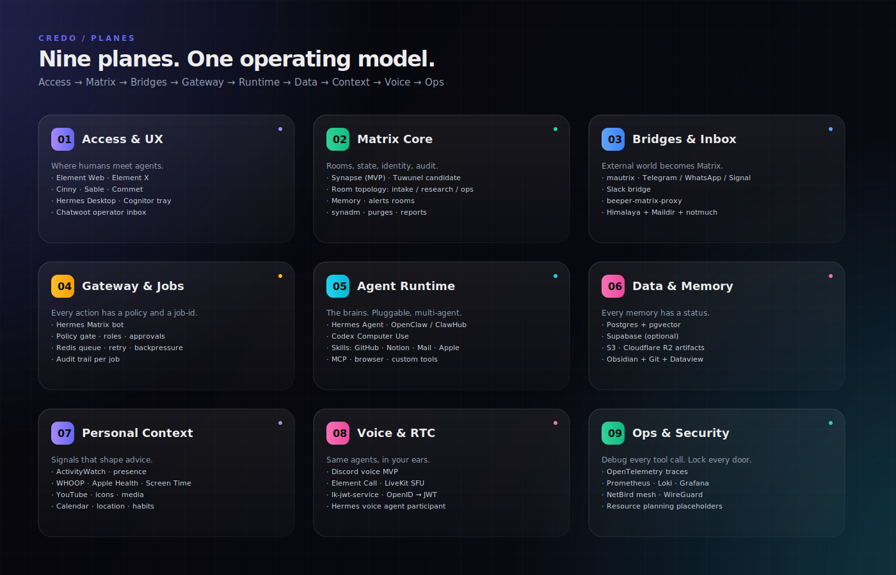
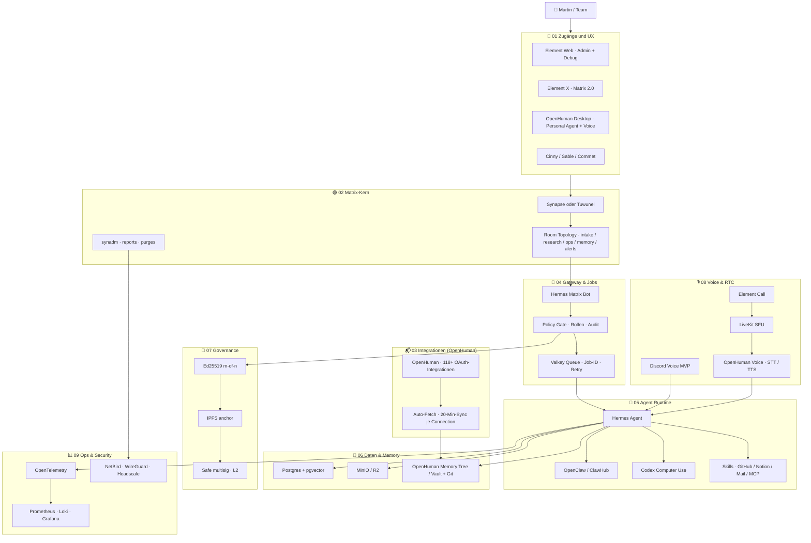

  

<h1 align="center">credo</h1>

  <strong>The agent OS for DAOs.</strong> 
  Self-hosted Matrix backbone · Ed25519-signed actions · m-of-n quorum · verifiable memory.

  <a href="https://martin-hausleitner.github.io/credo/"><strong>🌐 Live site</strong></a> ·
  <a href="#-vision">Vision</a> ·
  <a href="#-stack--open-source-first">Stack</a> ·
  <a href="#-openhuman-als-personal-edge-schicht">OpenHuman</a> ·
  <a href="#%EF%B8%8F-mvp-scope">MVP</a> ·
  <a href="docs/">Docs</a>

  
  
  
  

---

**credo** ist Martins Architekturdeck fuer einen selbst gehosteten, DAO-nativen Agent-Kommunikationsstack. **Matrix** als Raum-, Identity-, State- und Audit-Schicht. **Ed25519 + Safe + IPFS** als kryptografische Governance. **Hermes / OpenClaw / Codex** als Agent-Runtime. **[OpenHuman](https://github.com/tinyhumansai/openhuman)** als Personal-/Edge-Schicht: Desktop-UX, 118+ OAuth-Integrationen, Memory Tree / Vault und Voice. **PostgreSQL + pgvector + MinIO + cal.rs** als kanonisches Runtime-Ledger. Selbst hostbar, OSS-first im Backbone — OpenHuman-Edge mit bewussten Ausnahmen ([Details](docs/openhuman-integration.md)).

## ✨ Vision

| Pillar | TL;DR |
|---|---|
| 🎯 **MVP** | Synapse + Element/Cinny + **OpenHuman Desktop** · Hermes Matrix-Bot · Valkey · Postgres/pgvector · MinIO · cal.rs · NetBird mesh. |
| 🧬 **OpenHuman Edge** | Lokaler Personal-Agent als zweite Surface: Memory Tree / Vault, 118+ OAuth-Integrationen, Voice. Schreibt nur ueber Credos Write-Gates und Ed25519-Signatur. |
| 🪪 **DAO &amp; Krypto** | Risk-classed proposals · m-of-n **Ed25519** quorum · **IPFS** anchor · **Safe** multisig auf L2 (OP / Arbitrum / Base) · optional **Snapshot**. |
| 🎨 **Generative UI** | DesignSkill entwirft ein UI pro Action · Like-Loop refined · stabile Varianten werden zu kanonischen, "offizialisierten" Interfaces. |
| 🛡️ **Local-first** | Kein zentraler Server. Jeder Knoten haelt die volle Chronik, E2E verschluesselt. Keys verlassen das Geraet nicht. |
| 🌌 **Horizon 2026–2035** | Foundation (26–28) → Sovereignty (29–32: federated mesh, ZK governance, self-authoring skills) → Civic infrastructure (33–35). |
| 🟢 **Open Source First** | Jede Schicht zeigt auf ein OSS-Projekt mit bekannter Lizenz. Tailscale raus (closed coordinator); **NetBird + WireGuard + Headscale** rein. *Decentralisation without OSS is just outsourcing.* |

## 🧭 Start Here

| Frage | Kurzantwort | Link |
|---|---|---|
| Was ist credo? | Ein Matrix-zentriertes Betriebsmodell fuer Agentenarbeit. | [Operating Model](#%EF%B8%8F-operating-model) |
| Was ist entschieden? | Matrix = Kontext + Audit. Valkey/Worker = Jobs. Postgres + MinIO = kanonisches Ledger. | [Stack](#-stack--open-source-first) |
| Was baue ich zuerst? | Text-MVP mit Synapse, Clients, Bot, Valkey, Postgres, MinIO/R2 und NetBird. | [MVP Scope](#%EF%B8%8F-mvp-scope) |
| Wo sind Details? | Entscheidungen, Inventare, Roadmap und Research in `docs/`. | [Detail-Dokumente](#-detail-dokumente) |
| Wo ist die Live-Site? | [martin-hausleitner.github.io/credo](https://martin-hausleitner.github.io/credo/) | — |

## 🧱 Architektur

Die anderen Diagramme (Hero, Stack-Layers, Agent-Mesh, DAO-Governance, Audit-Trail, Horizon 2026–2035, Brand-Board) liegen in [`assets/`](assets/) und sind ueber die [Live-Site](https://martin-hausleitner.github.io/credo/) im Zusammenhang lesbar.

📐 Komplettes Mermaid-Gesamtbild (klicken zum Ausklappen)

## 🎛️ Operating Model

| # | Regel | Bedeutung |
|---|---|---|
| 01 | 🟢 Jeder Auftrag hat einen Raum | Matrix liefert Kontext, Menschen, State und eine nachvollziehbare Timeline. |
| 02 | 🚦 Jede Aktion hat eine Policy | Rollen, Freigaben und Risiken werden im Backend entschieden — vor der Queue und erneut vor jedem riskanten Tool-Call. |
| 03 | 🧾 Jeder Lauf hat eine Job-ID | Valkey/Worker entkoppeln lange Agentenarbeit vom Chat-Event. |
| 04 | 🗄️ Jedes Ergebnis hat ein Artefakt | MinIO/R2, Postgres und Matrix-Links halten Ergebnisse nachvollziehbar. |
| 05 | 🧠 Jede Erinnerung hat einen Status | Ephemeral, reviewed oder canonical — kein ungeprueftes Langzeit-Memory. |
| 06 | 📊 Jeder Tool-Call hat eine Spur | OTel / Grafana macht LLM, MCP, Tool, RAG und Sub-Agenten debugbar. |
| 07 | 🪪 Jede Aktion ist signiert | Ed25519 device keys · m-of-n Quorum · Matrix + IPFS + (optional) Safe. |

## 🧱 Stack — Open Source First

| Layer | Projekte | Lizenz |
|---|---|---|
| 🟢 Communication | Matrix Synapse · Element Web · Cinny | AGPL-3.0 · Apache-2.0 |
| 🧬 Edge & Integrationen | OpenHuman Desktop · 118+ OAuth-Integrationen (Composio) · Voice | GPL-3.0 · (Composio managed) |
| 🤖 Runtime & Queue | Hermes · OpenClaw · Codex · MCP · Valkey · Ollama | MIT · BSD-3 |
| 🧠 Data & Memory | PostgreSQL + pgvector · MinIO · IPFS / Kubo · OpenHuman Memory Tree · cal.rs | PG-Lic · AGPL-3.0 · GPL-3.0 · MIT |
| 🛡️ Network & Edge | NetBird · WireGuard · Headscale · Caddy · Coturn · LiveKit | BSD-3 · GPL-2.0 · Apache-2.0 |
| 📊 Observability | OpenTelemetry · Prometheus · Loki · Grafana · Tempo | Apache-2.0 · AGPL-3.0 |
| 🪪 Crypto & Governance | libsodium · Ed25519 · Safe Smart Account · Snapshot · ENS · IPFS | ISC · LGPL-3.0 · MIT · public goods |

> Tailscale ist raus (closed coordinator). **NetBird + WireGuard + Headscale** sind die fully-OSS Mesh-Alternativen. Wenn ein Projekt seine Lizenz aendert, haben wir den Fork bereit — **Valkey** statt Redis, **Headscale** statt Tailscale-Coordinator.
>
> **OpenHuman** (GPL-3.0) ist OSS, aber sein **Composio**-Connector und die **ElevenLabs**-TTS sind managed/proprietaer. Sie laufen nur als isolierte Edge-Schicht im MCP-Untrusted-Regime, mit OSS-Fallbacks (native Bridges, Piper/Coqui-TTS) und Write-Gates. Details: [docs/openhuman-integration.md](docs/openhuman-integration.md).

## 🧬 OpenHuman als Personal-/Edge-Schicht

[OpenHuman](https://github.com/tinyhumansai/openhuman) (tinyhumansai, GPL-3.0) ist ein reifer, lokaler Personal-Agent. In credo wird es die **Edge-Schicht**: Desktop-UX, Integrationen, lokales Memory und Voice — der governte Matrix-Backbone, die Jobs, die Signatur und das Audit bleiben credo.

| credo-Baustein (alt) | Jetzt: OpenHuman |
|---|---|
| Hermes Desktop · Cognitor Companion | **OpenHuman Desktop** (Tauri) als zweite Human-Surface |
| mautrix Bridges · Beeper · Mail-Inbox · Chatwoot | **118+ OAuth-Integrationen** mit 20-Min-Auto-Fetch |
| Logseq / Obsidian + ActivityWatch | **Memory Tree / Vault** (komprimierte Markdown-Chunks) |
| Hermes Voice Agent (STT/TTS) | **OpenHuman Voice** ueber Element Call / LiveKit |

**Leitplanken:** OpenHuman schreibt nie direkt kanonisch. Auto-Fetch-Daten sind *ephemeral und untrusted*, laufen durch Credos Write-Gates (Quellenlink, Review-Status, Loeschpfad) und werden vom Edge-Node **Ed25519-signiert**, bevor sie nach Postgres/pgvector kanonisieren. Composio + ElevenLabs bleiben isolierte, optionale Managed-Ausnahmen mit OSS-Fallbacks. Vollstaendiger Plan: [docs/openhuman-integration.md](docs/openhuman-integration.md).

## 🛣️ MVP Scope

1. 🟢 Matrix Homeserver (Synapse) aufsetzen.
2. 💬 Element Web + Cinny/Sable + OpenHuman Desktop bereitstellen.
3. 🤖 Hermes/OpenClaw Matrix-Bot registrieren (Bot vs. Appservice, Power Levels, Rate Limits, Invite-Policy, E2EE-Keys).
4. 🚦 Matrix-Nachrichten in Valkey-Jobs verwandeln (Policy-Gate davor).
5. 🧠 Postgres + pgvector fuer Memory/RAG.
6. 🗄️ MinIO oder Cloudflare R2 fuer Artefakte.
7. 🪪 Ed25519-Signaturen pro Job (libsodium); IPFS-Anchor fuer high-risk.
8. 📊 Redigierte Logs/Metriken intern sichtbar; Trace-ID zurueck in Matrix posten.
9. 🔐 Public vs. Admin Plane trennen: Clients/Federation/OpenHuman-Integrationen kontrolliert oeffentlich; Admin-APIs, Grafana, Loki, Prometheus, Postgres, Valkey und MinIO-Admin nur ueber **NetBird/WireGuard**.

## ⏳ Nicht im MVP

| Thema | Warum warten? |
|---|---|
| 🔒 E2EE Recording | Bots brauchen echte Teilnehmer-Keys; hoher Engineering-Aufwand |
| 🎥 4K60 MatrixRTC | Bandbreite, Codecs, Simulcast und Browser-Limits |
| 📱 Meta/Instagram Bridges | Ban-, Proxy-, Session- und Cookie-Risiko |
| 🗝️ Agenten mit Admin-Tokens | Nur in eng begrenzten Ops-Raeumen mit Audit |
| ☸️ Kubernetes | Fuer den Start Overkill; Ansible + Docker reicht |

## 📚 Detail-Dokumente

| Worum geht's? | Lies | Status |
|---|---|---|
| Zielstack | [docs/target-stack.md](docs/target-stack.md) | Entscheidung |
| Visuals & Diagramme | [docs/visual-gallery.md](docs/visual-gallery.md) | Guide |
| Architektur-Flows | [docs/architecture-flows.md](docs/architecture-flows.md) · [.mmd](docs/architecture.mmd) | Architektur |
| Matrix-Runbook | [docs/matrix-ops-runbook.md](docs/matrix-ops-runbook.md) | Runbook |
| Roadmap | [docs/implementation-roadmap.md](docs/implementation-roadmap.md) | Roadmap |
| Ressourcenplanung | [docs/resource-planning.md](docs/resource-planning.md) | Dimensionierung |
| Service-Katalog | [docs/service-catalog.md](docs/service-catalog.md) | Katalog |
| Packages & Skills | [docs/package-inventory.md](docs/package-inventory.md) · [hermes-skills.md](docs/hermes-skills.md) | Inventar |
| Repos | [docs/repository-map.md](docs/repository-map.md) · [local](docs/local-repositories.md) · [github](docs/github-repositories.md) · [matrix](docs/matrix-repositories.md) | Inventar |
| Stack-Vergleich | [docs/stack-comparison.md](docs/stack-comparison.md) | Vergleich |
| Research-Backlog | [docs/research-improvements.md](docs/research-improvements.md) | Synthese |
| OpenHuman-Integration | [docs/openhuman-integration.md](docs/openhuman-integration.md) | Plan |

## 🧼 Pflege-Regeln

- Neue Services zuerst in [docs/service-catalog.md](docs/service-catalog.md) eintragen.
- Neue lokale Packages in [docs/package-inventory.md](docs/package-inventory.md) kategorisieren.
- Neue eigene Repos in [docs/repository-map.md](docs/repository-map.md) einordnen.
- GitHub-Stars, lokale Repo-Zustaende und Screenshots sind Momentaufnahmen — bei groesseren Updates neu validieren.
- Architekturveraenderungen im README, in [docs/architecture.mmd](docs/architecture.mmd) und auf der Landing-Page synchron halten.
- Keine Tokens, Roh-Exports, personenbezogenen Chat-Inhalte oder privaten Credentials einchecken.

## 🔗 Repo

[github.com/Martin-Hausleitner/credo](https://github.com/Martin-Hausleitner/credo) — public · Open Source first · keine Notion-Tokens, keine Roh-Exports, keine privaten Credentials.
