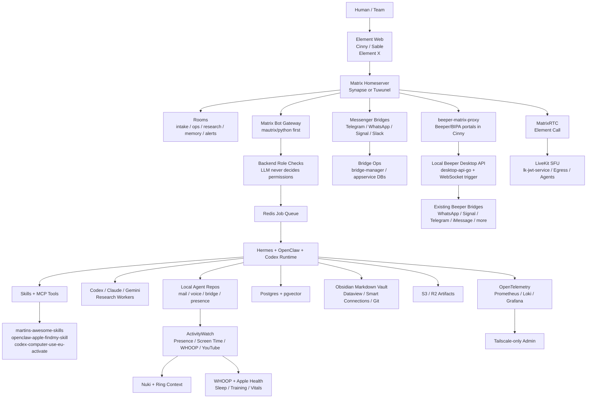
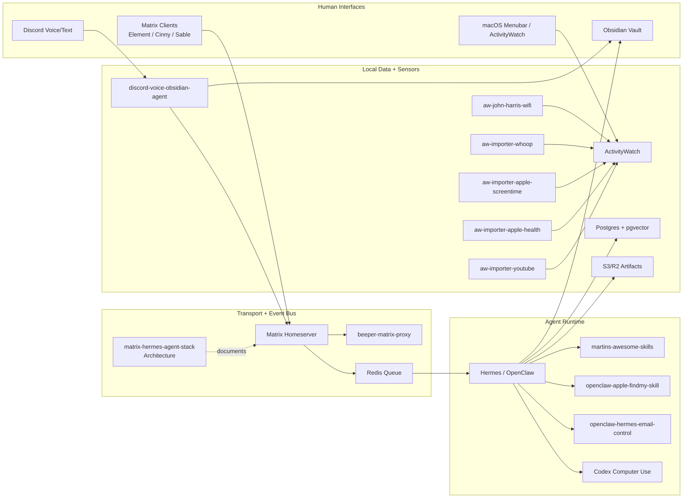

# Matrix + Hermes Agent Communication Stack

Ein pflegbares Architekturdeck fuer Martins selbst gehosteten Agent-Kommunikationsstack: Matrix als Raum-, Identity- und Audit-Bus; Hermes/OpenClaw/Codex als Agent-Runtime; ActivityWatch, WHOOP, Obsidian und lokale Skills als persoenlicher Daten- und Tool-Layer.


## Kurzurteil

Der beste Stack ist nicht "Matrix als Agent-Framework", sondern:

```text
Matrix = Kommunikations-, Raum-, Identity- und Audit-Schicht
Hermes/OpenClaw = Agent Runtime, Skills, Tools, Memory, Automationen
ActivityWatch/WHOOP/Obsidian = persoenlicher Kontext, Wissen und Lifelog
LiveKit = optionaler Voice/Call/Streaming-Strang
```

**MVP-Empfehlung:** Synapse oder Tuwunel, Element Web, Cinny/Sable, Hermes Matrix-Bot, Redis Queue, Postgres + pgvector, S3/R2, Tailscale-only Admin.

**Wenn maximale Kompatibilitaet wichtiger ist:** starte mit Synapse.  
**Wenn Ressourcen, RAM und S3 wichtiger sind:** teste Tuwunel zuerst.

## Bester Zielstack

| Ebene | Paket / Gewinner | Warum | Upstream GitHub | Eigene Umsetzung |
|---|---|---|---|---|
| Homeserver | Synapse oder Tuwunel | Synapse ist die sichere Referenz; Tuwunel ist leicht und S3-freundlich | [synapse](https://github.com/element-hq/synapse), [tuwunel](https://github.com/matrix-construct/tuwunel) | [matrix-hermes-agent-stack](https://github.com/Martin-Hausleitner/matrix-hermes-agent-stack) |
| Deployment | matrix-docker-ansible-deploy | Bewaehrte Matrix-Automation mit Docker, TLS, Bridges, TURN und Element | [spantaleev/matrix-docker-ansible-deploy](https://github.com/spantaleev/matrix-docker-ansible-deploy) | Dieses Repo als Runbook |
| Clients | Element Web + Cinny/Sable | Element als Referenz/Fallback, Cinny/Sable fuer schnelle Discord-artige UX | [element-web](https://github.com/element-hq/element-web), [cinny](https://github.com/cinnyapp/cinny), [Sable](https://github.com/SableClient/Sable) | Raum- und UX-Konzept in diesem Repo |
| Gateway | Matrix Bot Account | Einfacher, sicherer und schneller als sofortiger Appservice oder Custom Client | [mautrix/python](https://github.com/mautrix/python), [matrix-rust-sdk](https://github.com/matrix-org/matrix-rust-sdk) | [beeper-matrix-proxy](https://github.com/Martin-Hausleitner/beeper-matrix-proxy) als Bridge-Referenz |
| Inbox Bridge | Chatwoot + Himalaya + mbsync/notmuch + Mailpit | E-Mail, Matrix/Beeper und Agent-Ops laufen in einer lokalen Operator-Inbox zusammen | [chatwoot](https://github.com/chatwoot/chatwoot), [himalaya](https://github.com/pimalaya/himalaya), [notmuch](https://github.com/notmuch/notmuch), [mailpit](https://github.com/axllent/mailpit) | `/Users/mh/Documents/Playground/openclaw-hermes-email-control` |
| Runtime | Hermes + OpenClaw + Codex | Skills, Tools, Subagents, Memory, lokale Automationen | [hermes-agent](https://github.com/NousResearch/hermes-agent), [openclaw](https://github.com/openclaw/openclaw), [clawhub](https://github.com/openclaw/clawhub) | [martins-awesome-skills](https://github.com/Martin-Hausleitner/martins-awesome-skills), [codex-computer-use-eu-activate](https://github.com/Martin-Hausleitner/codex-computer-use-eu-activate) |
| Jobs | Redis Queue | Matrix Message rein, Job-ID zurueck, Worker fuehrt aus | [redis](https://github.com/redis/redis) | Zielkomponente im MVP |
| Memory/RAG | Postgres + pgvector | Robust, simpel, gut fuer Agent-Memory und semantische Suche | [postgres](https://github.com/postgres/postgres), [pgvector](https://github.com/pgvector/pgvector) | Zielkomponente im MVP |
| Storage | S3/R2 | Artefakte, Medien, Exporte und grosse Dateien ohne FUSE-Mounts | [synapse-s3-storage-provider](https://github.com/matrix-org/synapse-s3-storage-provider), [rclone](https://github.com/rclone/rclone) | Zielkomponente im MVP |
| Knowledge | Obsidian Markdown + Git | Local-first, versionierbar, agentenfreundlich | [obsidian-dataview](https://github.com/blacksmithgu/obsidian-dataview), [smart-connections](https://github.com/brianpetro/obsidian-smart-connections), [obsidian-git](https://github.com/Vinzent03/obsidian-git) | [obsidian-notion-ui-customization](https://github.com/Martin-Hausleitner/obsidian-notion-ui-customization) |
| Presence/Lifelog | ActivityWatch + WHOOP + lokale Importer | Tagesstatus, Fokus, Schlaf, Training, Screen Time und Mediennutzung | [ActivityWatch](https://github.com/ActivityWatch/activitywatch) | [aw-john-harris-wifi](https://github.com/Martin-Hausleitner/aw-john-harris-wifi), [aw-importer-whoop](https://github.com/Martin-Hausleitner/aw-importer-whoop), [aw-importer-apple-screentime](https://github.com/Martin-Hausleitner/aw-importer-apple-screentime), [aw-importer-youtube](https://github.com/Martin-Hausleitner/aw-importer-youtube) |
| Voice/RTC | Element Call + LiveKit | Solider separater Call-Strang, nicht Teil des Text-MVP | [element-call](https://github.com/element-hq/element-call), [livekit](https://github.com/livekit/livekit), [lk-jwt-service](https://github.com/element-hq/lk-jwt-service) | [discord-voice-obsidian-agent](https://github.com/Martin-Hausleitner/discord-voice-obsidian-agent) als schneller Voice-Prototyp |
| Observability | OTel + Prometheus + Loki + Grafana | Interne Metriken, Logs, Traces und Alerts | [opentelemetry-collector](https://github.com/open-telemetry/opentelemetry-collector), [prometheus](https://github.com/prometheus/prometheus), [loki](https://github.com/grafana/loki), [grafana](https://github.com/grafana/grafana) | Tailscale-only Admin |

## Package- und Tool-Inventar

Diese Tabelle ist die zentrale Liste fuer die Packages, Frameworks und Services, die im Stack genutzt werden oder als Zielkomponente vorgesehen sind.

| Paket / Tool | Kategorie | Wird genutzt in | Zweck | Status |
|---|---|---|---|---|
| `react` / `react-dom` | Frontend | Cognitor Web/Tray, Dashboard UI | Cognitor UI und Dashboard-Komponenten | aktiv |
| `vite` / `@vitejs/plugin-react` | Frontend Build | Cognitor Web/Tray | Lokale Web-/Tauri-UI bauen und previewen | aktiv |
| `typescript` | Sprache/Typing | Cognitor, Voice Agent, lokale Tools | Typisierte UI- und Tool-Entwicklung | aktiv |
| `lucide-react` | UI Icons | Cognitor Web/Tray, Dashboard UI | Einheitliche Icons fuer Tools, Status und Navigation | aktiv |
| `@tauri-apps/api` / `@tauri-apps/cli` | Desktop App | Cognitor Tray | Native macOS Tray-/Desktop-App | aktiv |
| `expo` / `react-native` / `@expo/vector-icons` | Mobile | Cognitor Mobile | Mobile Companion / LAN-Prototyp | aktiv |
| `playwright` | E2E/Browser | Root Workspace | Browser-Validierung und Screenshots | aktiv |
| `@cognitor/activitywatch` | internes Package | Cognitor Packages | ActivityWatch-Daten normalisieren | aktiv |
| `@cognitor/dashboard-ui` | internes Package | Cognitor Packages | Wiederverwendbare Dashboard-UI | aktiv |
| `@cognitor/icons` | internes Package | Cognitor Packages | Icon- und Asset-Zwischenschicht | aktiv |
| `node:test` | Test Runner | aw-importer-youtube | importer-nahe Unit Tests ohne zusaetzlichen Runner | aktiv |
| `sqlite3` CLI | lokales Tool | aw-importer-youtube | Chromium-History sicher aus SQLite-Kopien lesen | aktiv |
| `yt-dlp` | Metadaten | aw-importer-youtube | YouTube Titel, Kanal, Beschreibung, Dauer und Stats anreichern | aktiv |
| `python` / `click` / `python-dateutil` | CLI Importer | ActivityWatch Importer | robuste lokale Importer-CLIs | aktiv |
| `pytest` | Python Tests | ActivityWatch Importer | Regressionstests fuer Importer | aktiv |
| `@clack/prompts` | CLI UX | discord-voice-obsidian-agent | interaktive lokale Worker-/Setup-Prompts | aktiv |
| `tsx` | TypeScript Runtime | discord-voice-obsidian-agent | TS-Skripte ohne separaten Build ausfuehren | aktiv |
| `prisma` | Datenzugriff | discord-voice-obsidian-agent | strukturierter DB-Zugriff fuer Voice-/Transcript-Flows | aktiv |
| `sharp` | Medienverarbeitung | beeper-matrix-proxy | Avatare/Medien fuer Bridge-Proofs verarbeiten | aktiv |
| Synapse | Matrix Homeserver | Matrix Core | Konservativer Produktivstart mit bester Kompatibilitaet | MVP-Option |
| Tuwunel | Matrix Homeserver | Matrix Core | Ressourcenschonender Greenfield-Homeserver | MVP-Option |
| matrix-docker-ansible-deploy | Deployment | Matrix Ops | Homeserver, TLS, TURN, Bridges und Clients automatisiert deployen | empfohlen |
| Element Web | Matrix Client | Web/Admin | Referenz-, Admin- und Debug-Client | empfohlen |
| Element X iOS / Android | Matrix Client | Mobile | Mobile Hauptaccounts und Matrix 2.0 UX | optional |
| Cinny | Matrix Client | Web UX | Schnelle Discord-artige UX fuer Agentenraeume | empfohlen |
| Sable | Matrix Client | Web UX | Cinny-Fork mit Power-UX und QoL-Fokus | optional |
| Commet | Matrix Client | Alternative UX | Multi-Account-orientierter Matrix Client | beobachten |
| mautrix/python | Matrix SDK | Bot Gateway | Schneller Python-Bot und spaeter Appservice-Pfad | kern |
| matrix-rust-sdk | Matrix SDK | Bot/Gateway spaeter | Performanter Rust-Service fuer harte Runtime-Komponenten | spaeter |
| mautrix/telegram | Bridge | Messenger | Telegram in Matrix spiegeln | Bridge-Phase |
| mautrix/whatsapp | Bridge | Messenger | WhatsApp in Matrix spiegeln | Bridge-Phase |
| mautrix/signal | Bridge | Messenger | Signal in Matrix spiegeln | Bridge-Phase |
| mautrix/discord | Bridge | Messenger | Discord in Matrix, bevorzugt Bot/Guild sauber | optional |
| mautrix/slack | Bridge | Messenger | Slack in Matrix | optional |
| bridge-manager | Bridge Ops | Beeper/Bridge Betrieb | Bridge-Management als Referenz und Admin-Helfer | optional |
| beeper-matrix-proxy | Eigene Bridge | Beeper/BIPA -> Matrix | Beeper-Chats als Matrix-Portale in Cinny/Element nutzbar machen | aktiv |
| desktop-api-go | Beeper SDK | Beeper Desktop API | Lokale Beeper REST-API fuer Chat-, Media- und Account-Export | geplant/aktiv |
| mautrix/go bridgev2 | Bridge Framework | Matrix Appservices | Capabilities, Media, Backfill und Portal-/Puppet-Modelle | aktiv |
| Beeper Desktop API | lokaler Dienst | `127.0.0.1:23373` | Lokale Beeper-Raumlisten und Sync-Aktionen als kontrollierte Quelle | lokal aktiv |
| Chatwoot | Inbox/Ops | `openclaw-hermes-email-control` / lokaler Docker Stack | Gemeinsame Operator-Inbox fuer Chat, Matrix/Beeper und E-Mail | lokal aktiv |
| Mailpit | Mail Dev/Ops | `infra/chatwoot-local` | Sicherer lokaler SMTP-/Mail-Testlauf ohne externen Versand | lokal aktiv |
| Himalaya | E-Mail CLI | lokaler Mail-Stack | Accounts lesen, triagieren und fuer Agenten bereitstellen | aktiv |
| mbsync/isync | E-Mail Sync | lokaler Maildir-Stack | Mailboxen lokal spiegeln | teilaktiv |
| notmuch | E-Mail Index | lokaler Maildir-Stack | Schnelle Suche und Agentenfilter ueber Maildir | vorgesehen |
| Hermes Agent | Agent Runtime | Matrix Bot Worker | Orchestrierung, Sessions, Memory, Automationen | kern |
| OpenClaw | Agent Runtime | Lokaler Tool Layer | Skills, Tools und lokale Agent-Ausfuehrung | kern |
| ClawHub | Skill Registry | Skill Distribution | Katalog, Trust und Install-Layer fuer Skills | spaeter |
| Codex Computer Use | Native UI Automation | macOS/iPhone Mirroring | Native App-Steuerung und E2E-Validierung | aktiv |
| Redis | Queue | Gateway -> Worker | Matrix-Events entkoppeln und Jobs verteilen | kern |
| Postgres | Datenbank | Memory/Audit | Persistente Agent-, Audit- und App-Daten | kern |
| pgvector | Vector Search | Memory/RAG | Semantische Suche und Embedding-Storage | kern |
| Cloudflare R2 / S3 | Object Storage | Artefakte/Medien | Reports, Exporte, grosse Dateien und Matrix-Medien | kern |
| rclone | Storage Tool | Backup/Sync | Optionaler Storage-Transport und Backups | optional |
| Obsidian | Knowledge Base | Memory/Vault | Local-first Wissens- und Dokumentationsbasis | aktiv |
| Dataview | Obsidian Plugin | Vault Queries | Strukturierte Abfragen ueber Markdown/YAML | aktiv |
| Smart Connections | Obsidian Plugin | Vault RAG | Semantische Suche direkt im Vault | optional |
| Obsidian Git | Obsidian Plugin | Audit/Sync | Versionierung und Audit Trail fuer Memory | aktiv |
| ActivityWatch | Lifelog | Presence/Focus/Timeline | Lokale Aktivitaets-, Status- und Kontextdaten | aktiv |
| WHOOP Importer | Health Import | ActivityWatch | Schlaf und Training in ActivityWatch einspielen | aktiv |
| Apple Screen Time Importer | Device Import | ActivityWatch | iOS/macOS Screen-Time in ActivityWatch einspielen | aktiv |
| YouTube Importer | Media Import | ActivityWatch | Watch Sessions und Mediennutzung einspielen | aktiv |
| Nuki Bridge HTTP API | Door Context | Presence/Audit | Lokale Schlossdaten als Statussignal | aktiv |
| Ring API / CLI | Door Context | Presence/Audit | Ring Intercom Events und History via Cloud API | aktiv, Cloud-abhaengig |
| Element Call | RTC | Matrix Voice | MatrixRTC Frontend fuer spaetere Calls | spaeter |
| LiveKit | RTC/SFU | Voice/Streaming | SFU, Realtime Media, Agents und Egress | spaeter |
| lk-jwt-service | RTC Auth | MatrixRTC + LiveKit | Auth-Layer zwischen MatrixRTC und LiveKit | spaeter |
| LiveKit Egress | RTC Recording | Recording | Recording fuer unverschluesselte Call-Raeume | spaeter |
| LiveKit Agents | Voice Agents | AI Voice | Voice-Agent-Layer auf LiveKit | spaeter |
| OpenAI Realtime Agents | Voice MVP | Voice Prototyping | Niedrige Latenz fuer schnellen Voice-Agent-Pfad | optional |
| discord.py | Voice MVP | Discord Voice | Schneller praktischer Discord-Voice-Prototyp | optional |
| OpenTelemetry Collector | Observability | Runtime/Ops | Traces und Metriken mit Redaction | kern |
| Prometheus | Observability | Metrics | Metriken und Alerts | kern |
| Loki | Observability | Logs | Redigierte Logs intern speichern | kern |
| Grafana | Observability | Dashboards | Matrix-, Bridge-, Agent- und Host-Dashboards | kern |
| Tailscale | Private Network | Admin/Ops | Admin und Observability nur intern erreichbar machen | kern |
| agent-secrets | Security | Tool Runtime | Secret Handling fuer Agenten | optional |
| agent-scan | Security | Skill Review | Agent-/Skill-Risiken pruefen | optional |
| Atropos | Evals | Agent Quality | Agent-/Skill-Evals und Regressionstests | optional |

## Eigene Repos und Arbeitsbereiche

Diese Liste fokussiert die aktuellen agentenrelevanten Repos und Workspaces. Lokale Repos ohne Origin bleiben bewusst sichtbar, damit sie nicht aus dem Systembild fallen.

| Repo / Workspace | Rolle im Stack | Lokaler Pfad | Remote / Status |
|---|---|---|---|
| matrix-hermes-agent-stack | Dieses Architekturdeck und Build-Plan | `/Users/mh/Documents/Playground/matrix-hermes-agent-stack` | [Repo](https://github.com/Martin-Hausleitner/matrix-hermes-agent-stack) |
| openclaw-hermes-public-skills | Public-safe Hermes/OpenClaw Skill-Sammlung | `/Users/mh/Documents/Playground/openclaw-hermes-public-skills` | [Repo](https://github.com/Martin-Hausleitner/martins-awesome-skills) |
| openclaw-hermes-email-control | E-Mail-/Hermes-Control-Prototyp | `/Users/mh/Documents/Playground/openclaw-hermes-email-control` | lokal, kein Origin |
| openclaw-apple-findmy-skill | OpenClaw Skill fuer Apple Find My / Standort-Kontext | `/Users/mh/Documents/Playground/openclaw-apple-findmy-skill` | [Repo](https://github.com/Martin-Hausleitner/openclaw-apple-findmy-skill) |
| codex-computer-use-eu-activate | Codex Computer Use EU Activation Skill | `/Users/mh/Documents/Playground/codex-computer-use-eu-activate` | [Repo](https://github.com/Martin-Hausleitner/codex-computer-use-eu-activate) |
| aw-john-harris-wifi | ActivityWatch Presence, Wi-Fi, Nuki/Ring und Fokus-Status | `/Users/mh/Documents/GitHub/aw-john-harris-wifi` | [Repo](https://github.com/Martin-Hausleitner/aw-john-harris-wifi) |
| aw-importer-whoop | WHOOP Schlaf und Training nach ActivityWatch | `/Users/mh/Documents/Playground/aw-importer-whoop` | [Repo](https://github.com/Martin-Hausleitner/aw-importer-whoop) |
| aw-importer-apple-screentime | Apple Screen Time nach ActivityWatch | `/Users/mh/Documents/Playground/aw-importer-apple-screentime` | [Repo](https://github.com/Martin-Hausleitner/aw-importer-apple-screentime) |
| aw-importer-apple-health | Apple Health Export nach ActivityWatch | `/Users/mh/.openclaw/workspace/aw-importer-apple-health` | [Repo](https://github.com/Martin-Hausleitner/aw-importer-apple-health) |
| activitywatch-youtube-sync | YouTube Watch Sessions nach ActivityWatch | `/Users/mh/Documents/Playground/activitywatch-youtube-sync` | [Repo](https://github.com/Martin-Hausleitner/aw-importer-youtube) |
| aw-activitywatch-stack | ActivityWatch Gesamt-Doku, LaunchAgent- und Export-Workflows | `/Users/mh/.openclaw/workspace/aw-activitywatch-stack` | [Repo](https://github.com/Martin-Hausleitner/aw-activitywatch-stack) |
| activitywatch-xbar-plugin | Menubar-/Status-Sicht auf ActivityWatch-Daten | n/a | [Repo](https://github.com/Martin-Hausleitner/activitywatch-xbar-plugin) |
| whoop-menubar | Lokale WHOOP-/Health-Menubar Experimente | `/Users/mh/Documents/Playground/whoop-menubar` | lokal, kein Origin |
| discord-voice-obsidian-agent | Discord Voice Agent, ASR-Worker und Obsidian-Anbindung | `/Users/mh/Documents/Playground/discord-voice-obsidian-agent` | [Repo](https://github.com/Martin-Hausleitner/discord-voice-obsidian-agent) |
| sh-vcvm-matrix-bridgev2-src | Beeper/Matrix Bridge v2 Proxy Referenz | `/Users/mh/Documents/Playground/sh-vcvm-matrix-bridgev2-src` | [Repo](https://github.com/Martin-Hausleitner/beeper-matrix-proxy) |
| obsidian-notion-ui-customization | Obsidian/Notion UI und Knowledge-Experimente | `/Users/mh/Documents/Playground/obsidian-notion-ui-customization` | [Repo](https://github.com/Martin-Hausleitner/obsidian-notion-ui-customization) |
| mac-ai-dev-setup | Mac AI Dev Setup und lokale Agent Toolchain | `/Users/mh/Documents/Playground/mac-ai-dev-setup` | [Repo](https://github.com/Martin-Hausleitner/mac-ai-dev-setup) |
| mac-ram-rescue | Mac Memory-/Performance-Rescue Tooling | `/Users/mh/Documents/Playground/mac-ram-rescue` | [Repo](https://github.com/Martin-Hausleitner/mac-ram-rescue) |
| hermes-agent | Hermes-Fork mit Workspace-Customizations | n/a | [Repo](https://github.com/Martin-Hausleitner/hermes-agent) |
| openclaw-workspace | Skills, AGENTS, Prompts und Studio-Konfigurationen | n/a | [Repo](https://github.com/Martin-Hausleitner/openclaw-workspace) |
| eins | Health Vault / persoenliche Knowledge-Struktur | `/Users/mh/.openclaw/workspace/eins` | [Repo](https://github.com/Martin-Hausleitner/eins) |
| iphone-mirroring-eu-activate | iPhone Mirroring EU Upstream-Referenz | `/Users/mh/Documents/Playground/iphone-mirroring-eu-activate` | [Repo](https://github.com/timi2506/iphone-mirroring-eu-activate) |
| iphone-mirroring-eu-enabler | iPhone Mirroring EU Enabler Referenz | `/Users/mh/Documents/Playground/iphone-mirroring-eu-enabler` | [Repo](https://github.com/Pauli1Go/iphone-mirroring-eu-enabler) |
| APOLLO | iOS/macOS Forensics Referenz fuer lokale Datenquellen | `/Users/mh/Documents/Playground/APOLLO` | [Repo](https://github.com/mac4n6/APOLLO) |

## Architektur




## Repo- und Datenfluss



## MVP Scope

Der MVP soll **Text- und Job-Orchestrierung** stabil machen:

1. Matrix Homeserver aufsetzen.
2. Element Web + Cinny/Sable bereitstellen.
3. Einen Hermes/OpenClaw Matrix-Bot bauen.
4. Matrix-Nachrichten in Jobs verwandeln.
5. Jobs ueber Redis an Worker geben.
6. Ergebnisse in denselben Raum zurueckschreiben.
7. Postgres + pgvector fuer Memory/RAG anbinden.
8. S3/R2 fuer Artefakte und grosse Dateien verwenden.
9. Admin- und Observability nur ueber Tailscale exponieren.

## Nicht in den MVP

| Thema | Warum warten? |
|---|---|
| E2EE Recording | Bots brauchen echte Teilnehmer-Keys; hoher Engineering-Aufwand |
| 4K60 MatrixRTC | Bandbreite, Codecs, Simulcast und Browser-Limits machen es teuer |
| Eigener Matrix Client | Zu viel UI-/Crypto-/Sync-Komplexitaet |
| Meta/Instagram Bridges | Ban-/Proxy-/Session-Risiko |
| Agenten mit Admin-Tokens | Darf nur in eng begrenzten Ops-Raeumen passieren |
| Kubernetes | Fuer den Start Overkill; Ansible + Docker ist passender |

## Pflege-Regeln

- Neue Packages zuerst in `Package- und Tool-Inventar` aufnehmen.
- Eigene Repos zusaetzlich in `Eigene Repos und Arbeitsbereiche` eintragen.
- Architekturveraenderungen im README-Diagramm und in [docs/architecture.mmd](docs/architecture.mmd) synchron halten.
- Keine Tokens, Roh-Exports, personenbezogenen Chat-Inhalte oder privaten Credentials einchecken.

## Dokumente

- [Ausfuehrliche Vergleichstabelle](docs/stack-comparison.md)
- [Roadmap und Build-Plan](docs/implementation-roadmap.md)
- [Mermaid-Quellgraph](docs/architecture.mmd)

## Repo-Hinweis

Dieses Repo fasst die ausgewerteten Notion-Unterlagen, lokalen Repo-Infos und Stack-Reviews als oeffentlichkeitsarme Architektur-Spezifikation zusammen. Es enthaelt keine Notion-Tokens, keine Roh-Exports und keine privaten Credentials.
