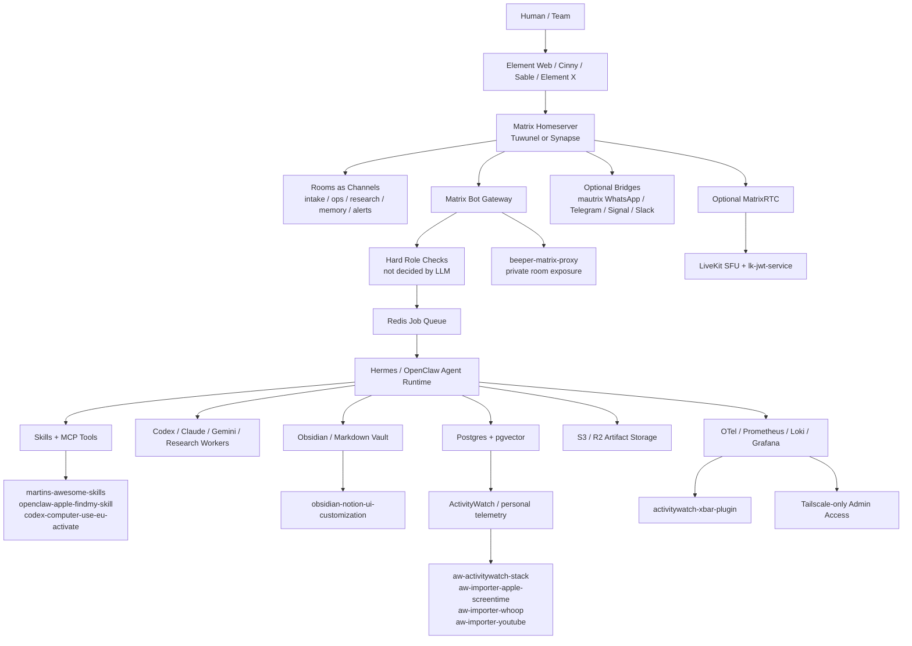
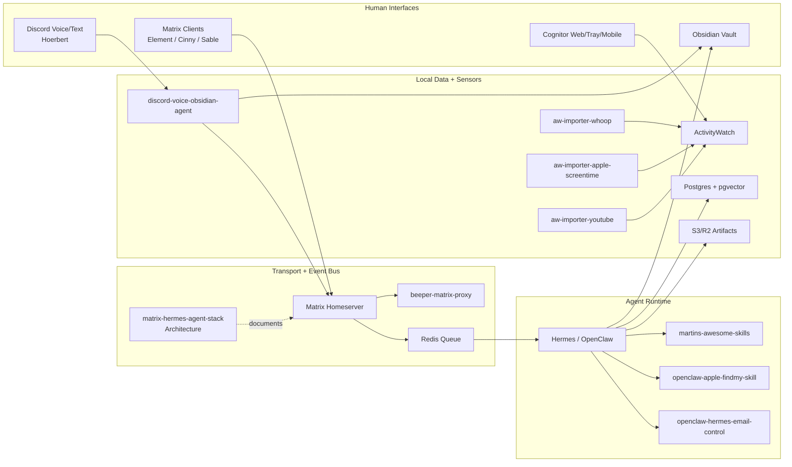

# Matrix + Hermes Agent Communication Stack

Eine kuratierte Architektur- und Technologieauswahl fuer ein selbst gehostetes Agent-Kommunikationssystem: Matrix als Raum-, Identity- und Audit-Bus; Hermes/OpenClaw/Codex als Agent-Orchestrierung dahinter.


## Kurzurteil

Der beste Stack ist nicht "Matrix als Agent-Framework", sondern:

```text
Matrix = Kommunikations-, Raum-, Identity- und Audit-Schicht
Hermes/OpenClaw = Agent Runtime, Skills, Tools, Memory, Automationen
LiveKit = optionaler Voice/Call/Streaming-Strang
Obsidian/Postgres = Memory, Wissen, RAG, Dokumentation
```

**MVP-Empfehlung:** Tuwunel oder Synapse, Element Web, Cinny/Sable, Hermes Matrix-Bot, Redis Queue, Postgres + pgvector, S3/R2, Tailscale-only Admin.

**Wenn maximale Kompatibilitaet wichtiger ist:** starte mit Synapse.  
**Wenn Ressourcen, RAM und S3 wichtiger sind:** teste Tuwunel zuerst.

## Bester Zielstack

| Ebene | Paket / Gewinner | Warum | Upstream GitHub | Eigenes Repo / Umsetzung |
|---|---|---|---|---|
| Homeserver | Tuwunel fuer Greenfield, Synapse fuer maximale Reife | Tuwunel ist leicht und S3-freundlich; Synapse ist die sichere Referenz | [tuwunel](https://github.com/matrix-construct/tuwunel), [synapse](https://github.com/element-hq/synapse) | [matrix-hermes-agent-stack](https://github.com/Martin-Hausleitner/matrix-hermes-agent-stack) |
| Deployment | matrix-docker-ansible-deploy | Bewaehrte Matrix-Automation mit Docker, TLS, Bridges, TURN, Element | [spantaleev/matrix-docker-ansible-deploy](https://github.com/spantaleev/matrix-docker-ansible-deploy) | [matrix-hermes-agent-stack](https://github.com/Martin-Hausleitner/matrix-hermes-agent-stack) |
| Webclient | Element Web + Cinny/Sable | Element als Referenz/Fallback, Cinny/Sable fuer schnelle Discord-artige UX | [element-web](https://github.com/element-hq/element-web), [cinny](https://github.com/cinnyapp/cinny), [Sable](https://github.com/SableClient/Sable) | [matrix-hermes-agent-stack](https://github.com/Martin-Hausleitner/matrix-hermes-agent-stack) |
| Agent Gateway | Matrix Bot Account | Einfacher, sicherer und schneller als sofortiger Appservice oder Custom Client | [mautrix/python](https://github.com/mautrix/python), [matrix-rust-sdk](https://github.com/matrix-org/matrix-rust-sdk) | [beeper-matrix-proxy](https://github.com/Martin-Hausleitner/beeper-matrix-proxy) |
| Agent Runtime | Hermes + OpenClaw + ClawHub | Skills, Tools, Subagents, Memory, lokale Automationen | [hermes-agent](https://github.com/NousResearch/hermes-agent), [openclaw](https://github.com/openclaw/openclaw), [clawhub](https://github.com/openclaw/clawhub) | [martins-awesome-skills](https://github.com/Martin-Hausleitner/martins-awesome-skills), [openclaw-apple-findmy-skill](https://github.com/Martin-Hausleitner/openclaw-apple-findmy-skill), [codex-computer-use-eu-activate](https://github.com/Martin-Hausleitner/codex-computer-use-eu-activate) |
| Jobs | Redis Queue | Matrix Message rein, Job-ID zurueck, Worker fuehrt aus | [redis](https://github.com/redis/redis) | [matrix-hermes-agent-stack](https://github.com/Martin-Hausleitner/matrix-hermes-agent-stack) |
| Memory/RAG | Postgres + pgvector | Robust, simpel, gut fuer Agent-Memory und semantische Suche | [pgvector](https://github.com/pgvector/pgvector) | [matrix-hermes-agent-stack](https://github.com/Martin-Hausleitner/matrix-hermes-agent-stack) |
| Storage | S3/R2 native, keine FUSE-Mounts | Medien und Dateien direkt in Object Storage; Metadaten lokal | [synapse-s3-storage-provider](https://github.com/matrix-org/synapse-s3-storage-provider), [rclone](https://github.com/rclone/rclone) | [matrix-hermes-agent-stack](https://github.com/Martin-Hausleitner/matrix-hermes-agent-stack) |
| Voice/RTC | Element Call + LiveKit spaeter | Solider separater Call-Strang, nicht Teil des Text-MVP | [element-call](https://github.com/element-hq/element-call), [livekit](https://github.com/livekit/livekit), [lk-jwt-service](https://github.com/element-hq/lk-jwt-service) | [matrix-hermes-agent-stack](https://github.com/Martin-Hausleitner/matrix-hermes-agent-stack) |
| Knowledge Workspace | Obsidian Markdown + Git + Dataview/Smart Connections | Local-first, versionierbar, agentenfreundlich | [obsidian-dataview](https://github.com/blacksmithgu/obsidian-dataview), [smart-connections](https://github.com/brianpetro/obsidian-smart-connections), [obsidian-git](https://github.com/Vinzent03/obsidian-git) | [obsidian-notion-ui-customization](https://github.com/Martin-Hausleitner/obsidian-notion-ui-customization) |

## Aktiv genutzte Packages und Komponenten

| Bereich | Package / Tool | Rolle im Stack | Status | Repo |
|---|---|---|---|---|
| Matrix Core | Synapse | Reifer Homeserver fuer Kompatibilitaet, Admin-API, Appservices und Bridges | Produktiv-Fallback | [element-hq/synapse](https://github.com/element-hq/synapse) |
| Matrix Core | Tuwunel | Leichter Homeserver fuer Greenfield-Tests, knappe Server und S3-orientierte Setups | Evaluieren | [matrix-construct/tuwunel](https://github.com/matrix-construct/tuwunel) |
| Deployment | matrix-docker-ansible-deploy | Automatisiertes Matrix-Deployment mit Docker, TLS, TURN, Clients und Bridges | Empfohlen | [spantaleev/matrix-docker-ansible-deploy](https://github.com/spantaleev/matrix-docker-ansible-deploy) |
| Web UI | Element Web / Element X | Referenzclient, Mobile-Zukunft und Debug-/Admin-Fallback | Pflicht | [element-web](https://github.com/element-hq/element-web), [element-x-ios](https://github.com/element-hq/element-x-ios), [element-x-android](https://github.com/element-hq/element-x-android) |
| Web UI | Cinny / Sable | Schnelle Discord-artige UX fuer Agent-Raeume und Beeper-Portale | Haupt-UX | [cinny](https://github.com/cinnyapp/cinny), [Sable](https://github.com/SableClient/Sable) |
| Beeper Gateway | beeper-matrix-proxy | Eigener Beeper/BIPA-zu-Matrix-Proxy und private Matrix-Bridge-Experimente | Eigener Kern | [Martin-Hausleitner/beeper-matrix-proxy](https://github.com/Martin-Hausleitner/beeper-matrix-proxy) |
| Beeper Gateway | desktop-api-go | Go-SDK fuer lokale Beeper Desktop REST-API; REST als Source of Truth | Proxy-Baustein | [beeper/desktop-api-go](https://github.com/beeper/desktop-api-go) |
| Bridge Runtime | mautrix/go bridgev2 | Matrix Bridge Framework fuer Capabilities, Media, Backfill und Appservice-Modelle | Kernbaustein | [mautrix/go](https://github.com/mautrix/go) |
| Bridge Ops | bridge-manager / bbctl | Beeper-Selfhosting, Bridge Registration, Runtime und lokale Verwaltung | Referenz | [beeper/bridge-manager](https://github.com/beeper/bridge-manager) |
| Messenger Bridges | mautrix WhatsApp / Telegram / Signal / Slack / Discord / Meta | Optionale direkte Matrix-Bridges und Referenzen fuer Media, Voice, Backfill, Avatare | Selektiv | [whatsapp](https://github.com/mautrix/whatsapp), [telegram](https://github.com/mautrix/telegram), [signal](https://github.com/mautrix/signal), [slack](https://github.com/mautrix/slack), [discord](https://github.com/mautrix/discord), [meta](https://github.com/mautrix/meta) |
| Agent Runtime | Hermes Agent | Agent-Orchestrierung, Sessions, Memory, Automationen und Subagents | Runtime-Kern | [NousResearch/hermes-agent](https://github.com/NousResearch/hermes-agent) |
| Agent Runtime | OpenClaw / ClawHub | Skills, lokale Tools, Skill Registry und Install-/Trust-Layer | Runtime-Kern | [openclaw](https://github.com/openclaw/openclaw), [clawhub](https://github.com/openclaw/clawhub) |
| Worker | Codex / Claude / Gemini / OpenCode | Code, Browser-Validierung, Research und Spezial-Subagents | Worker-Pool | n/a |
| Queue | Redis | Job Queue zwischen Matrix Gateway und Agent-Workern | MVP | [redis/redis](https://github.com/redis/redis) |
| Memory | Postgres + pgvector | Persistente Memory-, Audit- und Vektor-Suche | MVP | [postgres](https://github.com/postgres/postgres), [pgvector](https://github.com/pgvector/pgvector) |
| Storage | S3/R2 + synapse-s3-storage-provider | Artefakte, Medien, Backups und grosse Dateien ohne FUSE-Pflicht | MVP | [synapse-s3-storage-provider](https://github.com/matrix-org/synapse-s3-storage-provider), [rclone](https://github.com/rclone/rclone) |
| Knowledge | Obsidian + Dataview + Smart Connections + Git | Local-first Wissensbasis, semantische Suche und versionierte Runbooks | MVP | [obsidian-dataview](https://github.com/blacksmithgu/obsidian-dataview), [smart-connections](https://github.com/brianpetro/obsidian-smart-connections), [obsidian-git](https://github.com/Vinzent03/obsidian-git) |
| Voice/RTC | Element Call + LiveKit + lk-jwt-service | MatrixRTC, Calls, Voice-Agenten und spaeter Recording/Egress | Phase 4 | [element-call](https://github.com/element-hq/element-call), [livekit](https://github.com/livekit/livekit), [lk-jwt-service](https://github.com/element-hq/lk-jwt-service) |
| Observability | OTel + Prometheus + Loki + Grafana | Metriken, Logs, Traces, Kosten- und Bridge-Alerts | Phase 5 | [otel-collector](https://github.com/open-telemetry/opentelemetry-collector), [prometheus](https://github.com/prometheus/prometheus), [loki](https://github.com/grafana/loki), [grafana](https://github.com/grafana/grafana) |
| Network/Ops | Tailscale + Caddy | Private Admin-Netze, interne Routen, TLS und Reverse Proxy | Empfohlen | [tailscale](https://github.com/tailscale/tailscale), [caddy](https://github.com/caddyserver/caddy) |
| Lifelog | ActivityWatch + eigene Importer | WHOOP, Apple Screen Time, YouTube und lokale Kontextdaten fuer Agenten | Nebenstack | [ActivityWatch](https://github.com/ActivityWatch/activitywatch), [aw-importer-whoop](https://github.com/Martin-Hausleitner/aw-importer-whoop), [aw-importer-apple-screentime](https://github.com/Martin-Hausleitner/aw-importer-apple-screentime), [aw-importer-youtube](https://github.com/Martin-Hausleitner/aw-importer-youtube) |

## Package- und Tool-Inventar

Diese Tabelle ist das pflegbare Deck fuer die Bausteine, die im aktuellen lokalen Agent-/Matrix-/Cognitor-Setup genutzt oder als Zielkomponente vorgesehen sind.

| Paket / Tool | Kategorie | Wird genutzt in | Zweck | Status |
|---|---|---|---|---|
| `react` / `react-dom` | Frontend | `apps/web`, `apps/tray`, `packages/dashboard-ui` | Cognitor UI, Dashboard-Komponenten | aktiv |
| `vite` | Frontend Build | `apps/web`, `apps/tray` | Lokale Web-/Tauri-UI bauen und previewen | aktiv |
| `typescript` | Sprache/Typing | `apps/web`, `apps/tray` | Typisierte UI-Entwicklung | aktiv |
| `lucide-react` | UI Icons | `apps/web`, `apps/tray`, `packages/dashboard-ui` | Einheitliche Icons fuer Tools, Status und Navigation | aktiv |
| `@tauri-apps/api` / `@tauri-apps/cli` | Desktop App | `apps/tray` | Native macOS Tray-/Desktop-App fuer Cognitor | aktiv |
| `expo` / `react-native` | Mobile | `apps/mobile` | Mobile Companion / LAN-Prototyp | aktiv |
| `playwright` | E2E/Browser | Root Workspace | Browser-Validierung und Screenshots | aktiv |
| `@cognitor/activitywatch` | internes Package | `packages/activitywatch` | ActivityWatch-Daten normalisieren | aktiv |
| `@cognitor/dashboard-ui` | internes Package | `packages/dashboard-ui` | Wiederverwendbare Dashboard-UI | aktiv |
| `@cognitor/icons` | internes Package | `packages/icons` | Icon- und Asset-Zwischenschicht | aktiv |
| Tuwunel | Matrix Homeserver | Zielstack | Leichter Greenfield-Homeserver mit S3-Fokus | evaluieren |
| Synapse | Matrix Homeserver | Zielstack | Referenz-Homeserver und konservativer Produktivstart | fallback |
| matrix-docker-ansible-deploy | Deployment | Zielstack | Matrix, TLS, TURN, Bridges und Clients automatisiert deployen | empfohlen |
| Element Web / Element X | Matrix Client | Zielstack | Referenz-Client und Mobile-Hauptkonto | empfohlen |
| Cinny / Sable | Matrix Client | Zielstack | Schnellere Discord-artige UX fuer Agentenraeume | empfohlen |
| mautrix Bridges | Bridges | Zielstack | WhatsApp, Telegram, Signal, Slack, Discord anbinden | selektiv |
| Hermes / OpenClaw | Agent Runtime | Zielstack | Skills, Tools, Memory, Subagents und Automationen | kern |
| Redis | Queue | Zielstack | Matrix-Events in Jobs entkoppeln | kern |
| Postgres + pgvector | Memory/RAG | Zielstack | Agent-Memory, semantische Suche, Audit | kern |
| S3/R2 | Artefakte | Zielstack | Grosse Dateien, Medien, Reports, Exporte | kern |
| Obsidian + Git | Knowledge | Zielstack | Local-first Memory, Runbooks, Projektwissen | kern |
| Element Call + LiveKit | Voice/RTC | spaeter | MatrixRTC, Calls, Streaming, Voice Agents | spaeter |

## Eigene Repos und Arbeitsbereiche

Diese Liste fokussiert die aktuellen, agentenrelevanten Repos und Workspaces. Sie ist bewusst naeher am laufenden Stack als an der kompletten historischen GitHub-Liste.

| Repo / Workspace | Sichtbarkeit | Rolle im Stack | Lokaler Pfad | GitHub |
|---|---|---|---|---|
| matrix-hermes-agent-stack | privat | Architekturdeck fuer Matrix + Hermes/OpenClaw | `/Users/mh/Documents/Playground/matrix-hermes-agent-stack` | [Repo](https://github.com/Martin-Hausleitner/matrix-hermes-agent-stack) |
| cognitor-launcher | privat | Root-Monorepo fuer lokale Cognitor Apps und Packages | `/Users/mh/Documents/Playground` | [Repo](https://github.com/Martin-Hausleitner/cognitor-launcher) |
| discord-voice-obsidian-agent | privat | Hoerbert/Craig-Fork, lokale ASR-Worker, Voice-/Transcript-Prototyp | `/Users/mh/Documents/Playground/discord-voice-obsidian-agent` | [Repo](https://github.com/Martin-Hausleitner/discord-voice-obsidian-agent) |
| beeper-matrix-proxy | public | Bridgev2/Beeper-Matrix Proxy fuer private Raeume in Beeper | `/Users/mh/Documents/Playground/sh-vcvm-matrix-bridgev2-src` | [Repo](https://github.com/Martin-Hausleitner/beeper-matrix-proxy) |
| martins-awesome-skills | public | Public-safe Hermes/OpenClaw Skill-Sammlung | `/Users/mh/Documents/Playground/openclaw-hermes-public-skills` | [Repo](https://github.com/Martin-Hausleitner/martins-awesome-skills) |
| openclaw-apple-findmy-skill | public | OpenClaw Skill fuer Apple Find My / Standort-Kontext | `/Users/mh/Documents/Playground/openclaw-apple-findmy-skill` | [Repo](https://github.com/Martin-Hausleitner/openclaw-apple-findmy-skill) |
| openclaw-hermes-email-control | lokal | E-Mail-/Hermes-Control-Prototyp | `/Users/mh/Documents/Playground/openclaw-hermes-email-control` | noch kein Remote |
| aw-importer-whoop | public | WHOOP zu ActivityWatch Importer | `/Users/mh/Documents/Playground/aw-importer-whoop` | [Repo](https://github.com/Martin-Hausleitner/aw-importer-whoop) |
| aw-importer-apple-screentime | public | Apple Screen Time zu ActivityWatch Importer | `/Users/mh/Documents/Playground/aw-importer-apple-screentime` | [Repo](https://github.com/Martin-Hausleitner/aw-importer-apple-screentime) |
| aw-importer-youtube | public | YouTube Watch Sessions zu ActivityWatch | `/Users/mh/Documents/Playground/activitywatch-youtube-sync` | [Repo](https://github.com/Martin-Hausleitner/aw-importer-youtube) |
| mac-ram-rescue | privat | Mac Memory-/Performance-Rescue Tooling | `/Users/mh/Documents/Playground/mac-ram-rescue` | [Repo](https://github.com/Martin-Hausleitner/mac-ram-rescue) |
| obsidian-notion-ui-customization | public | Obsidian/Notion UI und Sync-Experimente | `/Users/mh/Documents/Playground/obsidian-notion-ui-customization` | [Repo](https://github.com/Martin-Hausleitner/obsidian-notion-ui-customization) |
| codex-computer-use-eu-activate | public | Codex Computer Use EU Activation Skill | `/Users/mh/Documents/Playground/codex-computer-use-eu-activate` | [Repo](https://github.com/Martin-Hausleitner/codex-computer-use-eu-activate) |
| mac-ai-dev-setup | privat | Mac AI Dev Setup, lokale Agent Toolchain | `/Users/mh/Documents/Playground/mac-ai-dev-setup` | [Repo](https://github.com/Martin-Hausleitner/mac-ai-dev-setup) |

## Architektur




## Repo- und Datenfluss



## MVP Scope

Der MVP soll **Text- und Job-Orchestrierung** stabil machen:

1. Matrix Homeserver aufsetzen.
2. Element Web + Cinny/Sable bereitstellen.
3. Einen Hermes/OpenClaw Matrix-Bot bauen.
4. Matrix-Nachrichten in Jobs verwandeln.
5. Jobs ueber Redis an Worker geben.
6. Ergebnisse in denselben Raum zurueckschreiben.
7. Postgres + pgvector fuer Memory/RAG anbinden.
8. S3/R2 fuer Artefakte und grosse Dateien verwenden.
9. Admin- und Observability nur ueber Tailscale exponieren.

## Nicht in den MVP

| Thema | Warum warten? |
|---|---|
| E2EE Recording | Bots brauchen echte Teilnehmer-Keys; hoher Engineering-Aufwand |
| 4K60 MatrixRTC | Bandbreite, Codecs, Simulcast und Browser-Limits machen es teuer |
| Eigener Matrix Client | Zu viel UI-/Crypto-/Sync-Komplexitaet |
| Meta/Instagram Bridges | Ban-/Proxy-/Session-Risiko |
| Agenten mit Admin-Tokens | Darf nur in eng begrenzten Ops-Raeumen passieren |
| Kubernetes | Fuer den Start Overkill; Ansible + Docker ist passender |

## Dokumente

- [Ausfuehrliche Vergleichstabelle](docs/stack-comparison.md)
- [Roadmap und Build-Plan](docs/implementation-roadmap.md)
- [Mermaid-Quellgraph](docs/architecture.mmd)

## Repo-Hinweis

Dieses Repo fasst die ausgewerteten Notion-Unterlagen und Subagent-Reviews als oeffentlichkeitsarme Architektur-Spezifikation zusammen. Es enthaelt keine Notion-Tokens, keine Roh-Exports und keine privaten Credentials.
