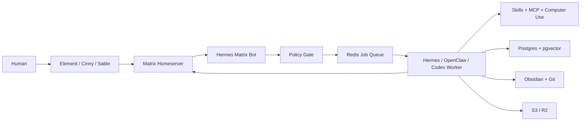
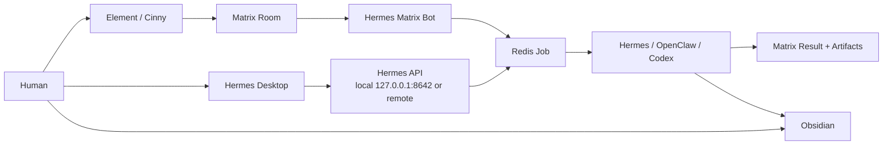
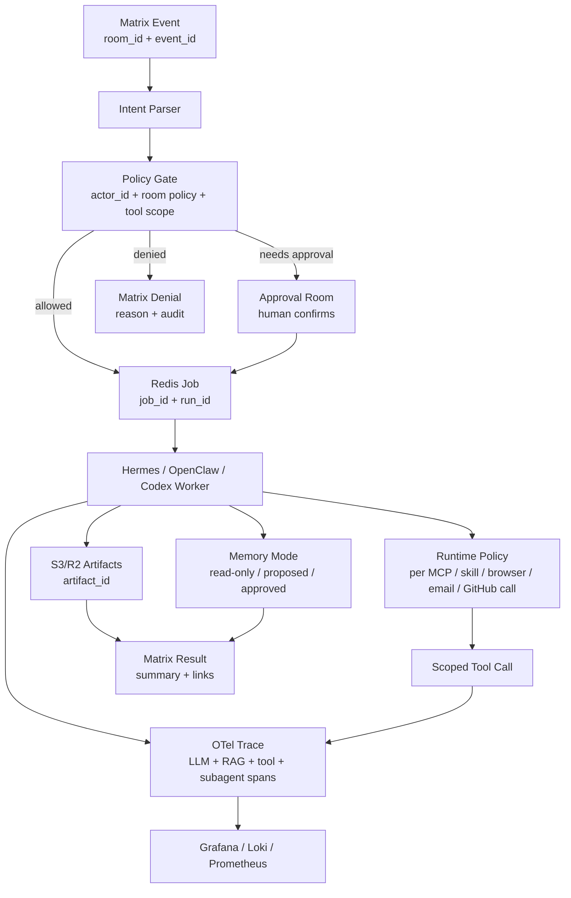
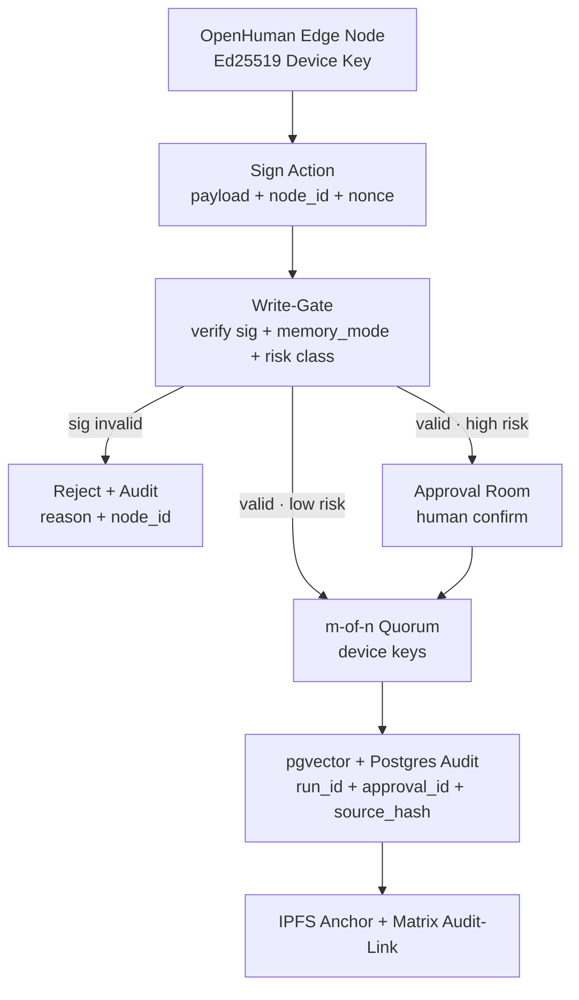
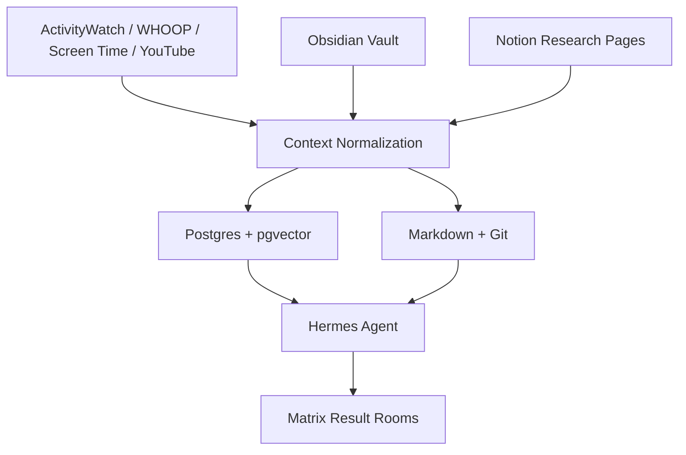
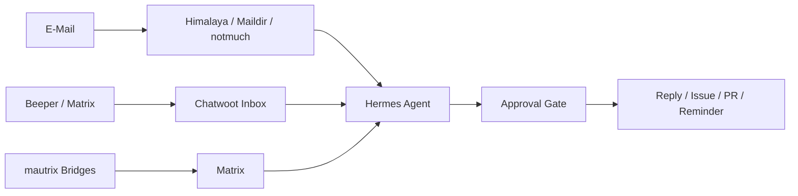
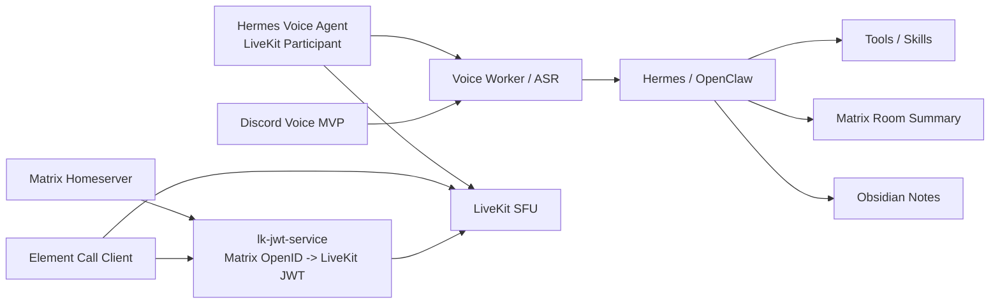

# Architekturfluesse

Das README enthaelt die grosse Gesamtkarte. Hier liegen die Detailfluesse fuer Betrieb, Daten und Repos.

Weitere visuelle Karten und Screenshot-Galerien liegen in [visual-gallery.md](visual-gallery.md).

## 🧭 Runtime Flow

## 🖥️ Control Surface Flow

## 🚦 Policy + Run Contract Flow

## 🧬 OpenHuman Edge Identity + Write-Gate Flow

Der OpenHuman-Desktop ist ein **Edge-Node mit eigener Identitaet**: ein Ed25519 Device Key, nicht der menschliche Account. Jede Edge-Aktion (Memory-Vorschlag, Connector-Write) wird mit diesem Key signiert und muss durch das Write-Gate, bevor sie kanonisch wird.

Identitaets- und Gate-Regeln:

1. Der OpenHuman-Node erhaelt bei Provisionierung einen eigenen Ed25519 Device Key, getrennt vom Menschen- und Bot-Account.
2. Jede Edge-Aktion traegt `node_id`, Payload-Hash und Nonce und wird signiert; das Gate verifiziert die Signatur vor jeder Policy-Pruefung.
3. Ungueltige oder unbekannte Signaturen werden verworfen und mit `node_id` und Grund auditiert.
4. Low-Risk-Writes laufen ueber das m-of-n Quorum der Device Keys; High-Risk-Writes brauchen zusaetzlich eine menschliche Freigabe im Approval-Raum.
5. Persistente Writes landen in pgvector plus Postgres-Audit (`run_id`, `approval_id`, `source_hash`) und werden ueber IPFS + Matrix verankert.
6. Key-Rotation und Revocation laufen ueber denselben Quorum-Pfad; ein revozierter Node-Key kann keine neuen Writes mehr signieren.

Mehr Details: [openhuman-integration.md](openhuman-integration.md), [target-stack.md](target-stack.md#-memory-bruecke-openhuman-vault--write-gate--pgvector). Quellen: [OpenHuman](https://github.com/tinyhumansai/openhuman), [libsodium Ed25519](https://doc.libsodium.org/public-key_cryptography/public-key_signatures).

## 🧠 Knowledge Flow

## 📬 Inbox Flow

## 🎙️ Voice Flow

