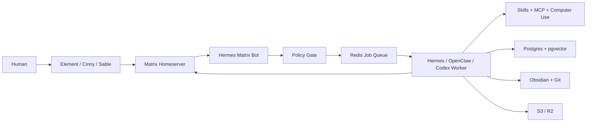
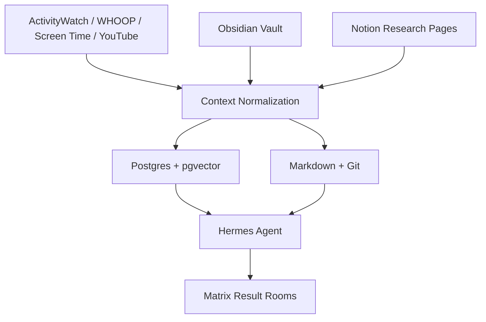
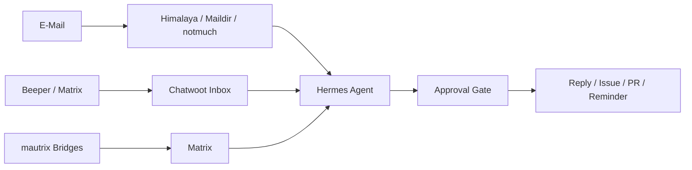
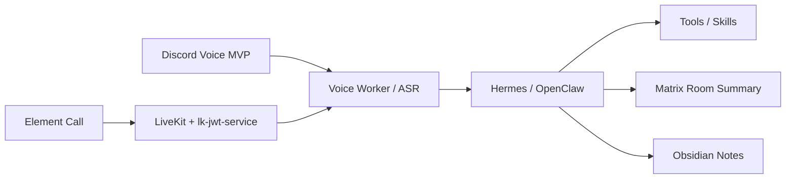

# Architekturfluesse

Das README enthaelt die grosse Gesamtkarte. Hier liegen die Detailfluesse fuer Betrieb, Daten und Repos.

## 🧭 Runtime Flow

## 🧠 Knowledge Flow

## 📬 Inbox Flow

## 🎙️ Voice Flow

