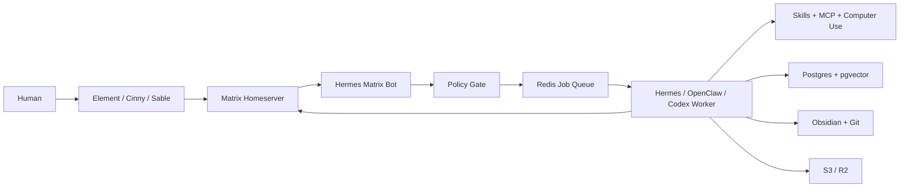
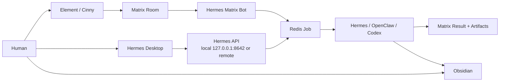
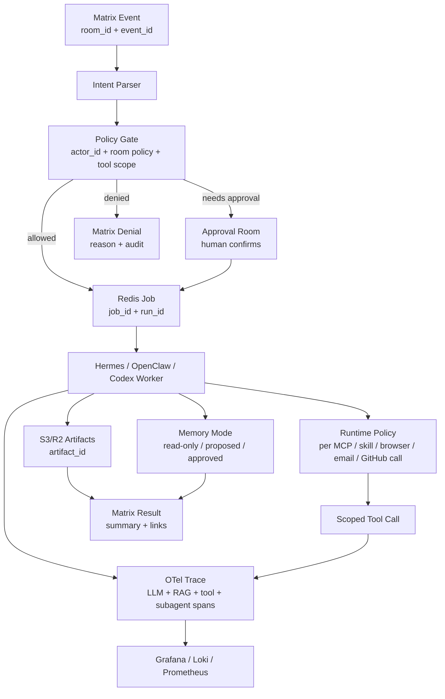
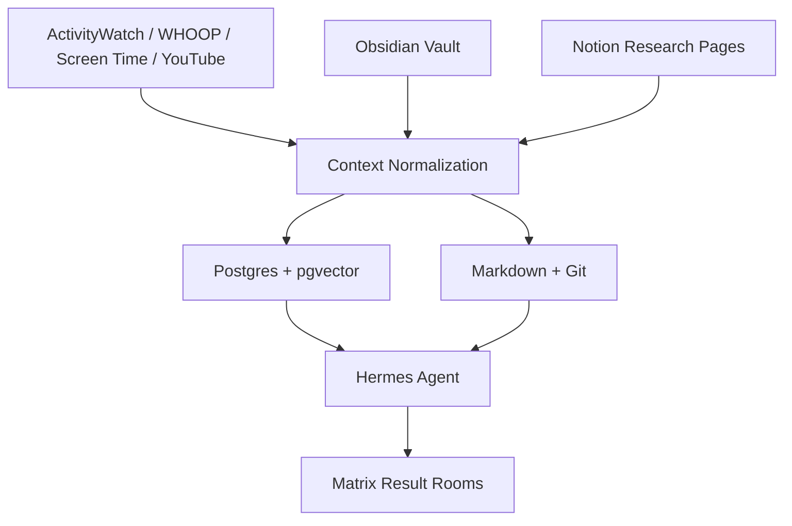
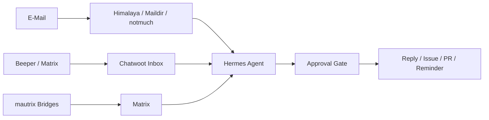
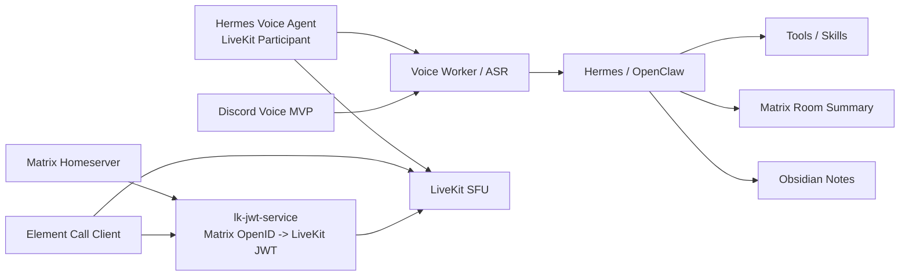

# Architekturfluesse

Das README enthaelt die grosse Gesamtkarte. Hier liegen die Detailfluesse fuer Betrieb, Daten und Repos.

Weitere visuelle Karten und Screenshot-Galerien liegen in [visual-gallery.md](visual-gallery.md).

## 🧭 Runtime Flow

## 🖥️ Control Surface Flow

## 🚦 Policy + Run Contract Flow

## 🧠 Knowledge Flow

## 📬 Inbox Flow

## 🎙️ Voice Flow

