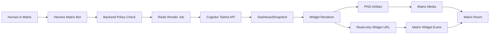
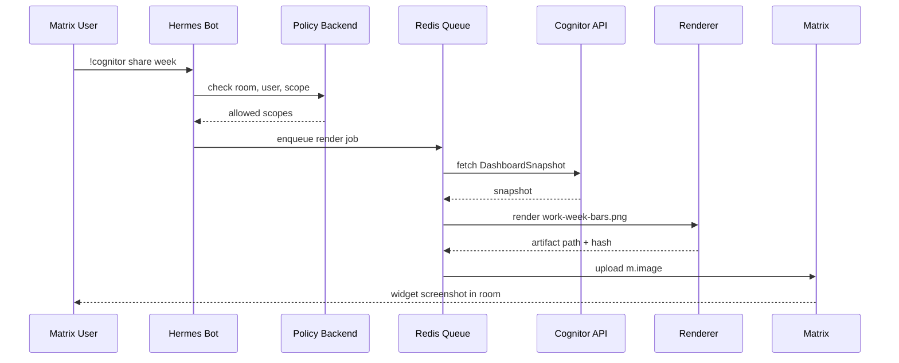

# Cognitor Widget Sharing Research

## Ziel

Cognitor soll seine ActivityWatch-, WHOOP-, Wetter-, Projekt- und Deep-Work-Widgets nicht nur lokal im Tray/WebUI anzeigen, sondern kontrolliert ueber Matrix teilbar machen:

- als statisches Bild im Chat
- als interaktives Matrix-Widget
- als Tailnet-Link fuer private Geraete
- optional spaeter als kurzlebiger Public-Link mit expliziter Freigabe

Matrix bleibt dabei Kommunikations-, Identity- und Audit-Schicht. Cognitor bleibt Datenquelle und Renderer.

## Kurzentscheidung

Der robuste Zielpfad ist:

```text
Cognitor Snapshot API -> Widget Renderer -> Matrix Hermes Bot -> Matrix Room
```

OpenUI oder generative UI sollte nur fuer kontrollierte Widget-Vorschlaege genutzt werden, nicht fuer direkte Runtime-Berechtigungen oder ungesichertes HTML.

## Architektur



## Komponenten

### Cognitor

Cognitor stellt die echten Daten bereit:

- ActivityWatch-Kategorien, Projekte und Browser-Tabs
- Computer/iPhone-Zeit
- Arbeitszeit, Privatzeit, Amusement und offene Wachzeit
- WHOOP Schlaf, Recovery, Strain, Schlafphasen und Trends
- Wetter und Tageskontext
- Service-Status nur read-only fuer Sharing

Der bestehende lokale Web/API-Pfad bleibt die private Quelle. Fuer Matrix wird er nur ueber Tailnet oder lokalen Worker angesprochen.

### Widget Manifest

Jedes teilbare Widget braucht ein Manifest:

```ts
type WidgetManifest = {
  id: string;
  title: string;
  description: string;
  dataScopes: WidgetDataScope[];
  defaultPeriod: "today" | "week" | "month";
  rendererTargets: ("png" | "matrix-widget" | "web")[];
  privacyLevel: "private" | "room-safe" | "public-safe";
};
```

Empfohlene erste Widgets:

- `work-week-bars`: Wochen-Balkendiagramm mit Arbeit, Privat, Amusement, Gym, Schlaf und Offen
- `project-allocation`: Projektzeit nach Money Maker, Self-Improvement, Communication, Ops/Finance
- `sleep-stage-summary`: Schlafphasen, REM, Leicht, Tief, Zyklen und Wake Events
- `whoop-rings`: Sleep, Recovery und Strain als kompakte Ringe
- `device-split`: Computer vs. iPhone, jeweils Arbeit vs. Nicht-Arbeit
- `deep-work-score`: Fokuszeit, Context-Switches, Agentenstarts und Handy-Wechsel

### Matrix Hermes Bot

Der Bot nimmt Kommandos entgegen:

```text
!cognitor share week
!cognitor share sleep 14d
!cognitor share project-allocation last-week
!cognitor widget work-week-bars
```

Der Bot entscheidet keine Berechtigungen per LLM. Rollen, Raeume und erlaubte Datenbereiche werden im Backend geprueft.

### Renderer

Der Renderer erzeugt aus echten Daten reproduzierbare Artefakte:

- PNG fuer sichere Chat-Posts
- read-only iframe fuer Matrix Widgets
- optional HTML Snapshot fuer lokale Vorschau

PNG ist der sicherste Default, weil es keine Live-Daten nachlaedt und in jedem Matrix-Client funktioniert.

## Sharing-Modi

| Modus | Einsatz | Risiko | Default |
|---|---|---:|---:|
| `matrix-image` | Screenshot/PNG in Matrix posten | niedrig | ja |
| `matrix-widget` | Interaktives iframe im Raum | mittel | spaeter |
| `tailnet-link` | Link fuer eigene Geraete | niedrig bis mittel | ja |
| `public-token` | Kurzlebiger oeffentlicher Link | hoch | nein |

## Sicherheitsregeln

- Keine externen Writes ohne explizite Freigabe.
- Keine Admin-APIs public.
- Public Links nur read-only, kurzlebig und widerrufbar.
- Kein rohes agent-generiertes HTML im Matrix-Widget.
- Widget-Daten werden per Scope begrenzt.
- Matrix Room ID, User ID, Widget ID, Zeitraum und Snapshot Hash werden auditierbar gespeichert.
- Private Daten wie genaue URLs, App-Titel oder Gesundheitsdetails brauchen eigene Freigabestufen.

## OpenUI-Einordnung

OpenUI ist fuer dieses System praktisch als Design- und Komponenten-Generator, aber nicht als Trust Boundary.

Sinnvoll:

- Widget-Ideen in standardisierte Komponenten uebersetzen
- konsistente Varianten fuer Karten, Ringe, Balken und Tooltips generieren
- Prototyping fuer Matrix-kompatible iframe-Widgets

Nicht sinnvoll:

- Berechtigungen entscheiden
- beliebiges HTML in Matrix-Raeume schreiben
- direkt auf ActivityWatch, WHOOP oder Browserdaten zugreifen

## Datenfluss fuer ein Bild



## Umsetzungsschritte

1. `packages/widgets` in Cognitor anlegen.
2. Widget-Manifeste und Daten-Scope-Typen definieren.
3. Playwright-basierten PNG-Renderer bauen.
4. Matrix-Hermes-Bot Command `!cognitor share` ergaenzen.
5. Tailnet-only API Zugriff konfigurieren.
6. Matrix Media Upload fuer PNG-Artefakte umsetzen.
7. Audit-Log mit Raum, Zeitraum, Scope und Snapshot Hash schreiben.
8. Erst danach interaktive Matrix Widgets per iframe zulassen.

## Offene Entscheidungen

- Soll `matrix-image` nur manuell oder auch automatisch woechentlich posten?
- Welche Raeume duerfen Gesundheitsdaten sehen?
- Werden Tailnet-Links in Matrix gepostet oder nur Bilder?
- Werden Matrix Widgets in Element Web priorisiert oder reicht PNG fuer v1?
- Soll Obsidian/Memory jeden geteilten Snapshot als Quelle verlinken?

## Quellen

- Matrix Widget API: https://github.com/matrix-org/matrix-widget-api
- Matrix Specification: https://spec.matrix.org
- Element Web: https://github.com/element-hq/element-web
- Matrix Rust SDK: https://github.com/matrix-org/matrix-rust-sdk
- Tailscale Serve/Funnel: https://tailscale.com/kb/1242/tailscale-serve
- OpenUI: https://github.com/wandb/openui
