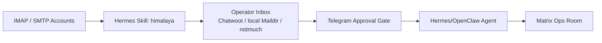

# Hermes-Skills-Inventar

Quelle: lokal installierte Skills unter `/Users/mh/.hermes/skills`. Diese Seite gruppiert die Skills danach, was sie im Matrix+Hermes-Agentenstack leisten koennen. Tokens, private Configs und Rohdaten sind nicht enthalten.

## Kategorieuebersicht

| Kategorie | Skills | Rolle im Stack |
|---|---|---|
| Apple / Personal Context | `apple-notes`, `apple-reminders`, `apple-find-my`, `imessage` | Lokale Apple-Notes, Reminders, Find-My-Kontext und iMessage/SMS als persoenliche Tool- und Kontextquellen. |
| Autonomous AI Agents | `claude-code`, `codex`, `hermes-agent`, `opencode` | Subagenten, Coding-Agenten, Hermes-Konfiguration und delegierte Entwicklungsarbeit. |
| Creative / Visuals | `ascii-art`, `ascii-video`, `excalidraw`, `manim-video`, `p5js`, `popular-web-designs`, `songwriting-and-ai-music` | Diagramme, Erklaervideos, generative Visuals, Musik und Frontend-Ideen fuer Docs und Demos. |
| Data Science | `jupyter-live-kernel` | Notebook-/Kernel-Zugriff fuer Datenanalyse, Charts und Experimentauswertung. |
| DevOps | `webhook-subscriptions` | Event-getriebene Agentenaktivierung durch externe Services. |
| Dogfood / QA | `dogfood` | Exploratives QA-Testing von Web-Apps mit Evidenz und Reports. |
| E-Mail | `himalaya` | IMAP/SMTP CLI fuer Lesen, Schreiben, Suchen, Antworten, Weiterleiten und Organisieren von E-Mails. |
| Gaming | `minecraft-modpack-server`, `pokemon-player` | Nischenautomation und Game-/Server-Experimente; nicht Kernstack. |
| GitHub | `codebase-inspection`, `github-auth`, `github-code-review`, `github-issues`, `github-pr-workflow`, `github-repo-management` | Repo-Management, PRs, Issues, Reviews, Auth, Codebase-Analysen und Release-Arbeit. |
| Leisure / Local Search | `find-nearby` | Orte finden, wenn Agenten lokalen Kontext fuer Alltag/Planung brauchen. |
| MCP | `mcp-cli-bridge`, `mcporter`, `native-mcp` | MCP-Server als lokale CLIs, native Tools und sichere Tool-Adapterschicht. |
| Media | `gif-search`, `heartmula`, `songsee`, `youtube-content` | GIFs, Musikgenerierung, Audioanalyse und YouTube-Content-Workflows. |
| Messaging | `telegram-approval-gate`, `telegram-channel-poster` | Telegram-Freigaben und Channel-Publishing, bevor Agenten extern posten/senden. |
| MLOps | `huggingface-hub` | Modelle, Datasets, Spaces und Inference-Ressourcen verwalten. |
| Note Taking | `obsidian` | Vault lesen, suchen, erstellen, updaten; Local REST/MCP/URI-Automation. |
| Productivity | `ai-research-output-publisher`, `google-workspace`, `linear`, `nano-pdf`, `notion`, `ocr-and-documents`, `powerpoint` | Research-Publishing, Gmail/Calendar/Drive, Linear, PDFs, Notion, OCR/Dokumente und PowerPoint. |
| Red Teaming | `godmode` | Nur fuer kontrollierte Robustheits-/Red-Team-Tests, nicht fuer normale Produktivflows. |
| Research | `arxiv`, `blogwatcher`, `comparison-deep-research`, `llm-wiki`, `polymarket`, `research-paper-writing` | Papers, RSS/Blogs, Vergleichsresearch, Wissensbasis, Prediction Markets und Paper-Writing. |
| Smart Home | `openhue` | Philips Hue / lokale Smart-Home-Steuerung als Kontext und Aktion. |
| Social Media | `xitter` | X/Twitter lesen/posten/suchen via CLI, nur mit bewusster Freigabe. |
| Software Development | `agent-browser-macos-profile-testing`, `ai-research-browser-cli`, `ai-research-browser`, `cloakbrowser-manager-local`, `codex-computer-use-control`, `cross-agent-skill-sync`, `google-deep-researcher`, `hidden-brave-comet-deep-research`, `local-tool-preflight`, `oracle-ai-research-e2e`, `plan`, `probowr`, `replit-comet-agent-browser`, `requesting-code-review`, `subagent-driven-development`, `systematic-debugging`, `test-driven-development`, `writing-plans` | Browser-E2E, Deep Research, Computer Use, Skill-Sync, lokale Tool-Preflights, Replit/Comet-Automation, Planen, Debugging, TDD und Reviews. |

## Besonders relevante Skills fuer den Hermes-Agent-Stack

| Skill | Warum wichtig |
|---|---|
| `himalaya` | Der E-Mail-Anker: Agenten koennen Inboxen lesen, triagieren, Entwuerfe vorbereiten und Support-/Operator-Flows bedienen. |
| `telegram-approval-gate` | Sicherheitsgurt fuer externe Kommunikation: bevor etwas gesendet/gepostet wird, kann Telegram Approval davor. |
| `notion` und `obsidian` | Notion als strukturierter Workspace, Obsidian als local-first Memory/Vault. |
| `google-workspace` | Gmail, Calendar, Drive, Docs und Sheets als grosser Productivity-Anschluss. |
| `github-*` | Der gesamte Entwicklungszyklus: Repos, Issues, PRs, Reviews, Auth und CI. |
| `native-mcp`, `mcporter`, `mcp-cli-bridge` | Toolschicht fuer lokale und externe MCP-Server ohne alles direkt in den Hauptkontext zu laden. |
| `codex`, `claude-code`, `opencode`, `subagent-driven-development` | Mehrere Agenten parallel fuer Entwicklung, Research, Review und Umsetzung. |
| `ai-research-browser-cli`, `ai-research-browser`, `hidden-brave-comet-deep-research` | Browsergestuetzte Research-Workflows mit echten Profilen und Screenshot-Evidenz. |
| `codex-computer-use-control` | Native macOS-App-Steuerung und visuelle Selbstvalidierung. |
| `local-tool-preflight` | Verhindert unnoetige Installationen und prueft vorhandene lokale Tools zuerst. |
| `systematic-debugging`, `test-driven-development`, `writing-plans` | Engineering-Disziplin fuer stabile Agentenarbeit. |

## E-Mail / Inbox Rolle

Der E-Mail-Teil ist nicht nur ein Skill, sondern ein Kernbaustein des Operator-Stacks:

Empfohlene Regel: Agenten duerfen E-Mail-Inhalte lesen und Entwuerfe vorbereiten. Externer Versand braucht Approval, Rollencheck und Audit.

## Skill-Governance

| Regel | Umsetzung |
|---|---|
| Skills duerfen keine Secrets enthalten | Tokens nur in Env, Keychain oder externen Configs. |
| Schreib-/Sendefunktionen brauchen Freigabe | Telegram Approval Gate oder explizite User-Anweisung. |
| Riskante Skills laufen isoliert | Browser, Social Media, Red Teaming und Shell-nahe Tools nur mit Scope. |
| Skill-Aenderungen werden versioniert | Git/ClawHub/Skill-Registry plus einfache Evals. |
| Agenten sehen nur noetige Tools | MCP/CLI-Bridge statt alle Toolschemas permanent in den Kontext. |
