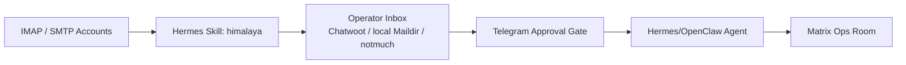

# Hermes-Skills-Inventar

Quelle: lokal installierte Skills unter `/Users/mh/.openclaw/workspace/skills`. Diese Seite gruppiert die Skills danach, was sie im Matrix+Hermes-Agentenstack leisten koennen. Tokens, private Configs und Rohdaten sind nicht enthalten.

## Kategorieuebersicht

| Kategorie | Skills | Rolle im Stack |
|---|---|---|
| Apple / Personal Context | `apple-find-my`, `apple-health-daily`, `apple-health-live-sync`, `apple-photos-local-search`, `apple-tv-control` | Apple Health, Fotos, Find My, Apple TV-Steuerung als persoenliche Kontext- und Automatisierungsquellen. |
| Autonomous AI Agents | `claude-code`, `codex`, `codex-computer-use-eu-activate`, `hermes-agent`, `opencode`, `subagent-driven-development` | Subagenten, Coding-Agenten, Computer Use (EU), Hermes-Konfiguration und delegierte Entwicklungsarbeit. |
| Browser / Computer Use | `agent-browser-clawdbot`, `agent-browser-gemini-export`, `ai-research-browser`, `ai-research-browser-cli`, `browser-profile-routing`, `browser-use`, `iphone-mirroring-eu`, `oracle-ai-research-e2e`, `replit-agent-browser-auth` | Headless Browser, Browser-Automation, Profile-Routing, iPhone Mirroring (EU), E2E-Research-Workflows. |
| Creative / Visuals | `ascii-art`, `excalidraw`, `gemini-opencode-studio`, `p5js`, `songwriting-and-ai-music` | Diagramme, generative Visuals, Musik und Frontend-Ideen fuer Docs und Demos. |
| Data Science | `jupyter-live-kernel` | Notebook-/Kernel-Zugriff fuer Datenanalyse, Charts und Experimentauswertung. |
| DevOps | `tailscale-render-orchestrator`, `webhook-subscriptions` | Event-getriebene Agentenaktivierung, Render-Orchestrierung via Tailscale. |
| Dogfood / QA | `dogfood` | Exploratives QA-Testing von Web-Apps mit Evidenz und Reports. |
| E-Mail | `himalaya`, `mail-backup-stack` | IMAP/SMTP CLI fuer Lesen, Schreiben, Suchen, Antworten, Weiterleiten, Organisieren und Backup von E-Mails. |
| Finance | `fintaro-calendar`, `pipa-ergin-finance-sync`, `wise-readonly` | Finanzkalender, Wise-readonly-Zugriff und Finance-Sync fuer Buchhaltungs-Workflows. |
| GitHub | `github-auth`, `github-code-review`, `github-issues`, `github-pr-workflow` | Repo-Management, PRs, Issues, Reviews, Auth und Release-Arbeit. |
| Health & Fitness | `apple-health-daily`, `apple-health-live-sync`, `whoop-activitywatch-import` | Apple Health Live-Sync, Whoop-/ActivityWatch-Import fuer persoenliches Health-Tracking. |
| Leisure / Local Search | `clicky`, `find-nearby` | Orte finden, Webanalyse; wenn Agenten lokalen Kontext fuer Alltag/Planung brauchen. |
| MCP | `native-mcp` | Native Tools und sichere Tool-Adapterschicht fuer lokale MCP-Server. |
| Media | `gif-search`, `songsee`, `tool-comparison-heatmap`, `youtube-content` | GIFs, Audioanalyse, Tool-Vergleiche und YouTube-Content-Workflows. |
| Messaging | `beeper`, `beeper-messaging`, `chat-inbox`, `signal-chats`, `telegram-approval-gate`, `telegram-channel-poster`, `telegram-chats`, `whatsapp-chats` | Beeper-Netzwerke (WhatsApp, Signal, Telegram, SMS), Chat-Inbox, Telegram-Freigaben und Channel-Publishing. |
| MLOps | `huggingface-hub` | Modelle, Datasets, Spaces und Inference-Ressourcen verwalten. |
| Note Taking | `notion`, `notion-openclaw-log`, `obsidian` | Notion als strukturierter Workspace inkl. OpenClaw-Log, Obsidian als local-first Memory/Vault. |
| Productivity | `ai-research-output-publisher`, `change-memory`, `deliverables`, `gogcli`, `mac-cleanup`, `maccy-history`, `ocr-and-documents`, `plan`, `writing-plans` | Research-Publishing, Gmail/Calendar/Drive (gog), Memory-Management, Deliverables, PDF/OCR, Clipboard, Mac-Cleanup, Planen. |
| Red Teaming | `godmode` | Nur fuer kontrollierte Robustheits-/Red-Team-Tests, nicht fuer normale Produktivflows. |
| Research | `arxiv`, `blogwatcher`, `comparison-deep-research`, `llm-wiki`, `multi-search-engine`, `polymarket`, `research-paper-writing` | Papers, RSS/Blogs, Multi-Engine-Suche, Vergleichsresearch, Wissensbasis und Prediction Markets. |
| Skill Management | `cross-agent-skill-sync`, `skill-finder` | Skills ueber Agenten synchronisieren und neue Skills aus ClawHub + Skills.sh finden und bewerten. |
| Smart Home | `door-presence-bridge`, `felix-presence-apple-tv`, `openhue` | Philips Hue, Tuer-Praesenz-Bridge, Apple-TV-Praesenz-Erkennung fuer Smart-Home-Automation. |
| Social Media | `xitter` | X/Twitter lesen/posten/suchen via CLI, nur mit bewusster Freigabe. |
| Software Development | `requesting-code-review`, `systematic-debugging`, `test-driven-development` | Code-Reviews anfordern, Debugging-Workflows und TDD fuer stabile Agentenarbeit. |

## Besonders relevante Skills fuer den Hermes-Agent-Stack

| Skill | Warum wichtig |
|---|---|
| `himalaya` | Der E-Mail-Anker: Agenten koennen Inboxen lesen, triagieren, Entwuerfe vorbereiten und Support-/Operator-Flows bedienen. |
| `telegram-approval-gate` | Sicherheitsgurt fuer externe Kommunikation: bevor etwas gesendet/gepostet wird, kann Telegram Approval davor. |
| `beeper-messaging` | Zentraler Messaging-Hub: WhatsApp, Signal, Telegram, SMS, Matrix ueber eine einheitliche Schnittstelle. |
| `notion` und `obsidian` | Notion als strukturierter Workspace, Obsidian als local-first Memory/Vault. |
| `gogcli` | Gmail, Calendar, Drive, Docs und Sheets als grosser Productivity-Anschluss. |
| `github-*` | Der gesamte Entwicklungszyklus: Repos, Issues, PRs, Reviews und Auth. |
| `native-mcp` | Toolschicht fuer lokale MCP-Server ohne alles direkt in den Hauptkontext zu laden. |
| `codex`, `claude-code`, `opencode`, `subagent-driven-development` | Mehrere Agenten parallel fuer Entwicklung, Research, Review und Umsetzung. |
| `ai-research-browser-cli`, `ai-research-browser`, `browser-use` | Browsergestuetzte Research-Workflows mit echten Profilen und Screenshot-Evidenz. |
| `codex-computer-use-eu-activate` | Native macOS-App-Steuerung und Computer Use in der EU aktivieren. |
| `skill-finder` | Neue Skills aus ClawHub + Skills.sh entdecken, bewerten und installieren. Aktiviert bei Capability-Gaps. |
| `apple-health-daily`, `whoop-activitywatch-import` | Persoenliches Health-Tracking und Fitness-Daten fuer Kontext-Queries. |
| `wise-readonly`, `fintaro-calendar` | Finanzueberblick und Kalender fuer Buchhaltungs- und Finance-Workflows. |
| `systematic-debugging`, `test-driven-development`, `writing-plans` | Engineering-Disziplin fuer stabile Agentenarbeit. |

## E-Mail / Inbox Rolle

Der E-Mail-Teil ist nicht nur ein Skill, sondern ein Kernbaustein des Operator-Stacks:

Empfohlene Regel: Agenten duerfen E-Mail-Inhalte lesen und Entwuerfe vorbereiten. Externer Versand braucht Approval, Rollencheck und Audit.

## Skill-Governance

| Regel | Umsetzung |
|---|---|
| Skills duerfen keine Secrets enthalten | Tokens nur in Env, Keychain oder externen Configs. |
| Schreib-/Sendefunktionen brauchen Freigabe | Telegram Approval Gate oder explizite User-Anweisung. |
| Riskante Skills laufen isoliert | Browser, Social Media, Red Teaming und Shell-nahe Tools nur mit Scope. |
| Skill-Aenderungen werden versioniert | Git/ClawHub/Skill-Registry plus einfache Evals. |
| Agenten sehen nur noetige Tools | MCP/CLI-Bridge statt alle Toolschemas permanent in den Kontext. |
| Neue Skills werden im Inventar eingetragen | Nach jeder Installation `hermes-skills.md` in diesem Repo updaten. |
