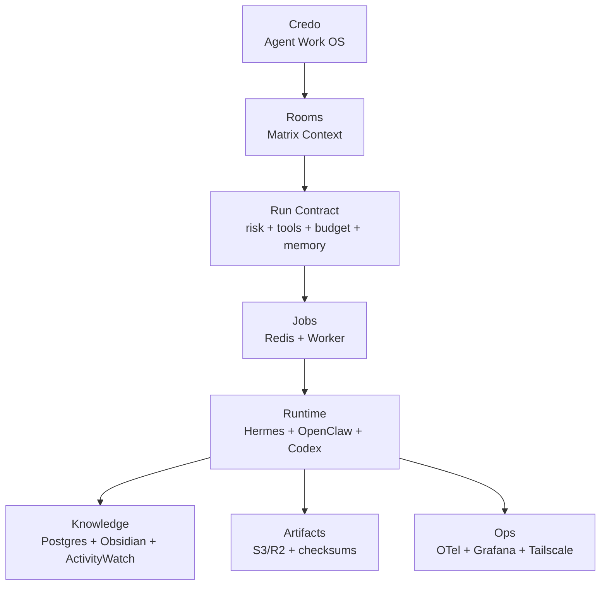
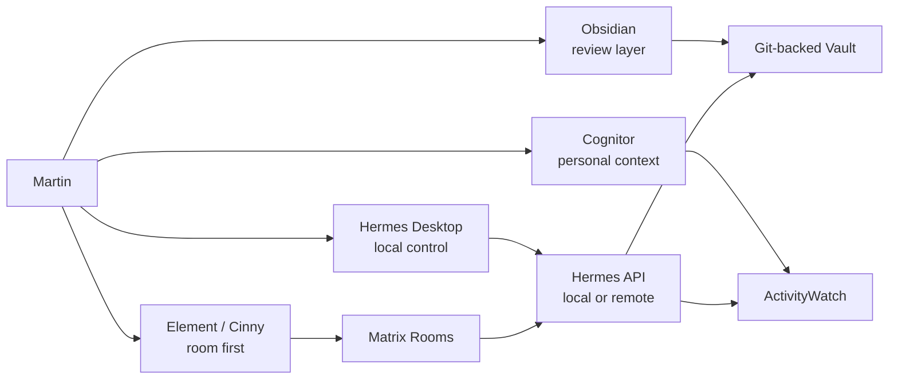
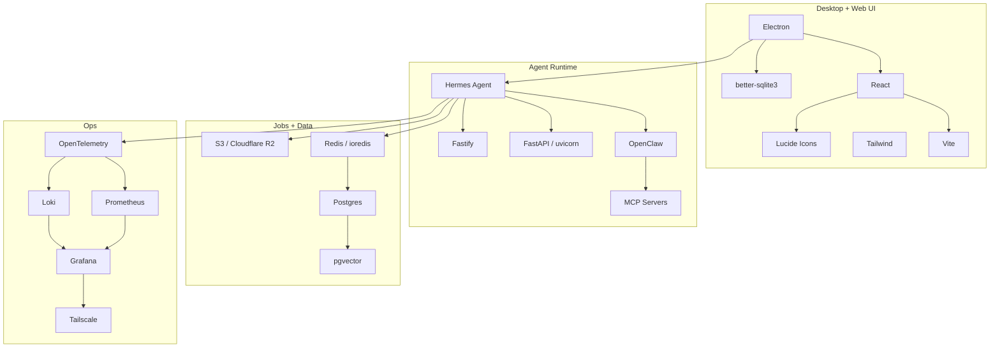
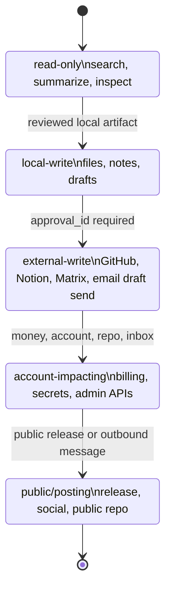
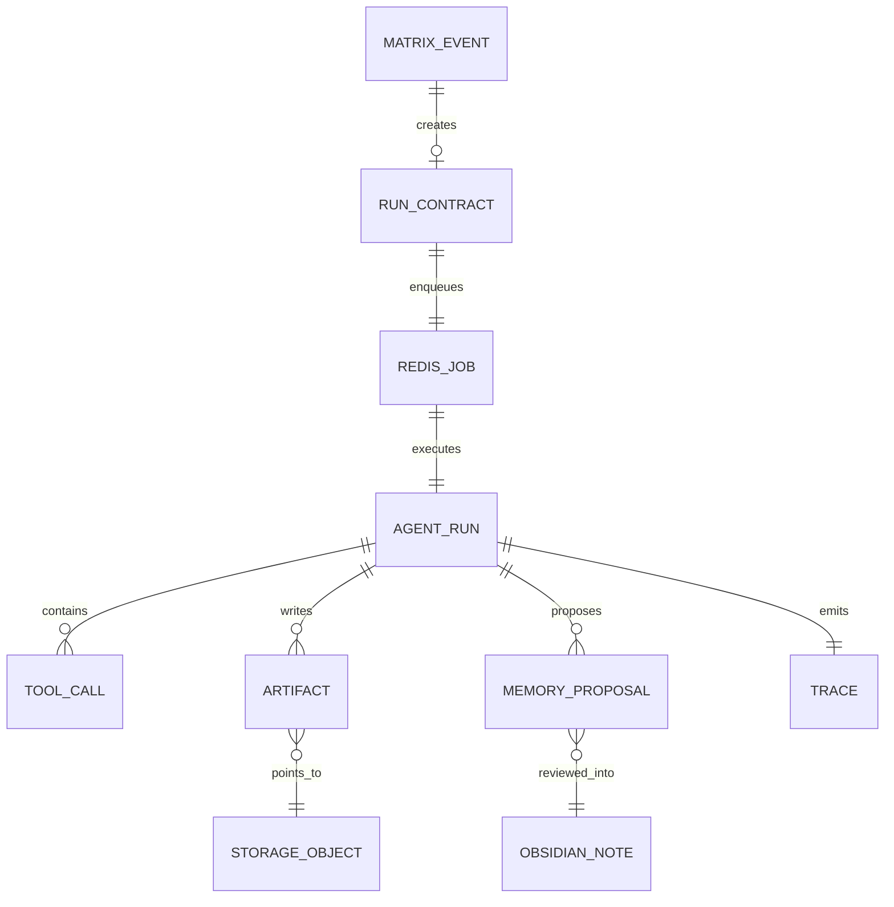
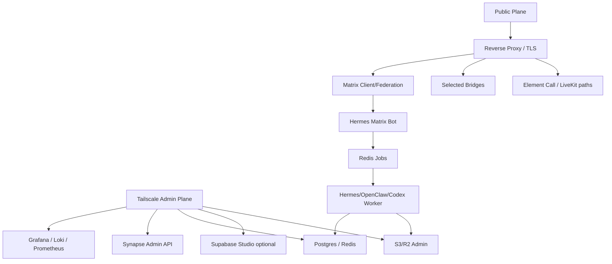

# Visual Gallery und Diagramme

Diese Datei ist die visuelle Schnellspur fuer Credo: mehr Screenshots, mehr Mermaid-Diagramme und staerker abstrahierte Karten. Die grossen Inventare bleiben in den spezialisierten Dateien, hier geht es um Orientierung.

## Stack Planes

## Screen Gallery

| Bereich | Preview | Rolle in Credo |
|---|---|---|
| Hermes Desktop Chat |  | lokale Agent-Schaltzentrale fuer Chat, Tool-Fortschritt und Sessions |
| Hermes Desktop Skills |  | sichtbares Skill-Management fuer Hermes/OpenClaw-nahe Workflows |
| Hermes Desktop Gateway |  | Messaging-Gateways als Desktop-konfigurierbare Oberflaeche |
| Hermes Desktop Schedules |  | Cron-/Automationsansicht fuer wiederkehrende Agentenarbeit |
| Element Web |  | Matrix-Referenzclient fuer Admin, Debugging und Kompatibilitaet |
| Cinny |  | schnelle Agent-Raum-UX |
| OpenClaw |  | lokale Skills, Tools und Automationen |
| Supabase |  | optionaler Dashboard/Auth/Realtime-Beschleuniger |

## Layer Abstraction

## Control Surfaces

## Library Map

## Policy Ladder

## Data Shape

## Deployment Plane

## Visual Reading Order

| Reihenfolge | Datei | Warum |
|---:|---|---|
| 1 | [README.md](../README.md) | North Star, Zielstack und MVP-Scope |
| 2 | [visual-gallery.md](visual-gallery.md) | Bilder, Diagramme und abstrakte Layer |
| 3 | [target-stack.md](target-stack.md) | konkrete Stack-Entscheidung |
| 4 | [architecture-flows.md](architecture-flows.md) | Runtime-, Policy-, Knowledge-, Inbox- und Voice-Flows |
| 5 | [package-inventory.md](package-inventory.md) | Libraries, Frameworks und Tools |
